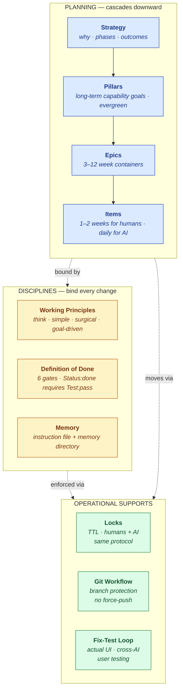

# AI Development Methodology

How to run a software project when some of your contributors are AI agents — and one of them just panic-refactored your auth middleware at 2am while a different one was halfway through the same task.

Twelve short docs. Markdown + git. No SaaS, no signup, no vendor lock-in. Read in 90 minutes; use forever (or until you find something better).

By **Miklós Polgár** ([polgarmiklos@gmail.com](mailto:polgarmiklos@gmail.com)) — [CC BY 4.0](LICENSE). Fork it, ship it, charge for it, teach it. Just keep the credit.

---

## TL;DR

- **Four planning layers** — strategy → pillars → epics → items. Each answers a different question.
- **Three discipline overlays** — working principles, Definition of Done, lessons-learned memory. They bind every change.
- **File-based locks with TTL** so two AI agents (or two humans) don't both grab the same item.
- **Fix-test loop for the actual UI** because "tests pass" doesn't mean "the page renders."
- **Cross-AI validation + user testing** as the final gates.
- **Plan before non-trivial work.** Use your tool's plan mode.
- Battle-tested in one production project. Currently [v1.4.0](CHANGELOG.md).

---

## How it fits together

Four planning layers cascade downward; three disciplines bind every change at every layer; three operational supports make the daily work navigable.



For the file layout and how the cascade physically lives on disk, see [How the work cascades](#how-the-work-cascades) below.

---

## What you get

The concrete payoffs after a week or two of adoption:

- **Work stops drifting.** Items trace from today's commit back to a phase in the strategy. "Why are we doing this?" is answerable without re-arguing it every quarter.
- **The backlog tells the truth.** `Status: done` requires `Test: pass` — no partial credit. Trust in the backlog comes back.
- **Parallel agents stop colliding.** File-based locks with TTL handle the coordination that chat-based "I've got this" can't.
- **The same mistake doesn't come back.** Memory entries make recurring fixes a one-time cost.
- **AI agents stay on task.** Four working principles forbid the speculative-abstraction / scope-creep / "let me also clean this up" pattern that LLMs default to.
- **Verification catches what tests miss.** White pages, broken dark mode, bypassed auth gates, missing imports — caught at the actual-UI gate, not in production.
- **AI-as-yes-man becomes visible.** A copy-paste counter-prompt ("what's wrong with this plan?") makes you challenge before approving.
- **The cheating agent gets caught.** When one model writes both the implementation and the tests that validate it, the green suite hides bugs. A different model auditing catches them.
- **Portable across tools.** Switching Claude Code → Cursor → Codex doesn't mean re-learning your process — only swapping the project-instruction filename.
- **No vendor lock-in.** Markdown and git. If your AI tool is gone in 18 months, your methodology isn't.

---

## Why this exists

Most projects accumulate the same failure modes once they last more than a few weeks. AI-assisted projects accumulate them twice as fast — the effective contributor count doubles and the new contributors don't sleep.

| The problem | How this set closes it |
|---|---|
| Direction drifts; every quarter re-litigates "what are we building?" | [Strategy docs](methodology/01_strategy.md) — versioned phases with exit criteria. |
| "Done" means whatever the contributor decides. | [Definition of Done](methodology/07_definition_of_done.md) — six binary gates; hard rule `Status: done` requires `Test: pass`. |
| "Tests pass" but the page is white, dark mode broken, auth bypassed. | [Actual-UI fix-test loop](methodology/10_testing_and_verification.md) with required dimensions. |
| Lessons evaporate; same mistake every six months. | [Two-layer memory](methodology/08_lessons_and_memory.md) — instruction file + memory directory. |
| Parallel contributors collide; two agents grab the same item silently. | [File-based locks with TTL](methodology/05_locks_and_parallel_work.md) — humans and agents, same protocol. |
| AI agents wander off-task — speculation, scope creep, "while I'm here" refactors. | [Working principles](methodology/06_working_principles.md) — distilled from real LLM failure modes. |
| AI agrees with you and you're both wrong. | [Challenge before consenting](methodology/06_working_principles.md). |
| AI writes broken code AND broken tests that validate it. | [Cheating agent anti-pattern](methodology/10_testing_and_verification.md) + cross-AI validation. |
| Humans become strangers in their own codebase. | [Human roles](methodology/11_human_roles.md) — supervisory layer, four anti-patterns. |
| The trunk breaks; force-push, destructive command, day gone. | [Git workflow rules](methodology/09_git_workflow.md) — branch protection, AI never deploys, never destructive. |
| Work doesn't compound across sessions, contributors, or tools — each new session re-derives the context. | [Plans, items, and memory all persist in files](methodology/00_README.md#how-the-system-enables-long-term-multi-session-work). Drop items today; another agent picks them up next week. The backlog *is* the queue. |
| Picking the next item turns into "whichever feels interesting"; cheap high-value work gets skipped. | [ROI-based prioritization](methodology/04_backlog_items.md#prioritization--the-roi-heuristic) — `Priority:` + `Effort:` fields make "highest-impact-per-effort" the default picking rule. Deviation is explicit, not silent. |
| Human-blocked work freezes agents indefinitely; AI sits on a lock for credentials it'll never get. | [`HUMAN_NEEDED.md`](methodology/04_backlog_items.md#human_neededmd--work-blocked-on-human-agency) — dedicated file tracks blocked items so agents release the lock and move on; humans see pending delegations in one place. |
| Long autonomous runs (overnight, weekend, milestone push) drift without a structure to ratchet against. | [`AUTONOMOUS_LOOP.md`](templates/AUTONOMOUS_LOOP.md) — loop prompt that picks the highest-impact ready item, executes through the DoD, archives, repeats. Stops at milestone, when no ready items remain, or on user check-in. |
| Done items pile up and become unsearchable; deferred ideas get lost. | `ARCHIVE.md` keeps every done item grep-able forever. `FUTURE.md` keeps deferred ideas alive without cluttering active work. Both are standard files in every epic folder. |

---

## What's in the repo

```
ai-development-methodology/
├── README.md                 # this file
├── CHANGELOG.md              # version history (self-applies the methodology)
├── LICENSE                   # CC BY 4.0
├── STATUS.md                 # maintenance posture
├── methodology/              # the 12 methodology docs (00–11)
├── templates/
│   ├── CLAUDE.md             # project-instruction file (Claude Code)
│   ├── AGENTS.md             # vendor-neutral version (extra plan/tool/safety sections)
│   ├── AGENT_KICKOFF.md      # planning-mode prompt for new projects
│   ├── AUTONOMOUS_LOOP.md    # prompt for long autonomous dev sessions
│   └── PROJECT_STRUCTURE.md  # recommended folder layout + naming conventions
└── self-development/         # the methodology applied to its own development (worked example)
    ├── AUTONOMOUS_LOOP.md    # Step 4 — adapted loop config (operational cycle)
    ├── brief/                # Step 0 outputs — vision, audience, competitive landscape, etc.
    ├── strategy/             # Step 1 — master plan (vision + 4 phases + pillar roadmap)
    ├── pillars/              # Step 1 — 9 capability-layer pillars (P1..P9)
    └── backlog/              # Step 2 — 5 epic charters; Step 3 — 14 BL-#### items inside active epics
```

~11,400 lines across 52 files. Longest doc ~1,000 lines. Each doc is self-contained — read in any order.

---

## How the work cascades

From "your brief" (the upstream work the methodology *doesn't* do) all the way down to a single line in a `BACKLOG.md` file — and where each artifact lives on disk.

```mermaid
flowchart TB
    BRIEF["📝 <b>Your brief</b> — Step 0, BEFORE the methodology kicks in<br/><i>what · who · success metrics · competitors · business viability · tech stack · 5–10 capability layers</i>"]

    BRIEF ==>|"answers become strategy docs"| STRAT

    STRAT["📐 <b>docs/strategy/</b> &nbsp; (the WHY)<br/>00_master_plan.md — vision · phases · outcomes<br/>+ supporting docs: 01_market · 02_differentiation · ... 10_roadmap<br/><i>versioned snapshots; never overwritten</i>"]

    STRAT ==>|"strategy defines which capabilities matter"| PIL

    PIL["🏛 <b>docs/pillars/</b> &nbsp; (the LONG-TERM GOALS)<br/>P1_&lt;area&gt;.md · P2_&lt;area&gt;.md · ... PN_&lt;area&gt;.md<br/><i>5–10 evergreen capability goals, sequentially dependent</i>"]

    PIL ==>|"each pillar advanced by epics"| EPICS
    PIL -.->|"design exploration first"| PLAN
    PLAN["🎨 <b>docs/planning/</b> <i>(optional)</i><br/>pre-epic design work · becomes the charter when ready"]
    PLAN -.-> EPICS

    EPICS["📋 <b>backlog/epics/NN-slug/</b> &nbsp; (3–12 week delivery containers)<br/>├── <b>README.md</b> &nbsp;← charter: primary pillar, binary exit criteria, out-of-scope<br/>├── <b>BACKLOG.md</b> ← active items<br/>├── <b>ARCHIVE.md</b> ← done items<br/>└── <b>FUTURE.md</b> &nbsp;← deferred / out-of-scope-but-noted<br/><br/>At the backlog root:<br/>· <b>EPICS.md</b> — cross-epic rollup<br/>· <b>HUMAN_NEEDED.md</b> — items blocked on human agency"]

    EPICS ==>|"items live inside each epic's BACKLOG.md"| ITEMS

    ITEMS["🔖 <b>Items — BL-XXXX format</b> &nbsp; (sized to the contributor: 1–2 weeks for humans · daily for AI)<br/><br/>Summary table at top — one line per item: <code>ID │ Title │ Priority │ Effort │ Status</code><br/><br/>Each item's detailed block has frontmatter fields:<br/>· <b>Pillar:</b> P3 &nbsp;&nbsp; · <b>Priority:</b> P0–P3 &nbsp;&nbsp; · <b>Effort:</b> XS–XL<br/>· <b>Status:</b> backlog → ready → in-progress → under-review → to-be-tested → done<br/>· <b>Test:</b> not-tested → pass &nbsp;&nbsp; · <b>Lock:</b> &lt;holder&gt;@&lt;TTL-expiry&gt;<br/>+ body: goal · plan · verification step per substep<br/><br/><i>No separate ticket types — features, bug fixes, tasks, and user stories all use the same BL-XXXX shape.</i>"]
```



**Step 0 is foundational.** The brief (product, target user, market, viability, tech stack, capability layers) is *your* work, not the methodology's. The methodology *records and operationalizes* those decisions; it does not invent them. Skipping this produces a velocity illusion — shipping confidently-built wrong product. See the "Step 0" callout in [How to use it](#how-to-use-it) for the long version.

**One ticket type, used flexibly.** Items can be feature-shaped, bugfix-shaped, task-shaped, or user-story-shaped (Given/When/Then), but they all use the same `BL-XXXX` frontmatter and live in the same `BACKLOG.md`. No separate Jira-style ticket-type taxonomy.

---

## Who it's for

- Solo developers using AI coding agents who want process that survives past week 3.
- Small teams mixing humans and AI agents, tired of "who's working on what?" being a question.
- Indie hackers and startup founders who need real process without enterprise overhead.
- Engineering leaders fitting AI agents into existing workflows.

**Not** for: large enterprises with existing process frameworks. This won't replace SAFe.

---

## How to use it

### On a new project (the high-leverage path)

Hand the methodology to your AI agent in planning mode *before* you write any code. By the time you start implementing, the structure is in place.

**Step 0 — Have a brief.** This methodology executes on goals; it doesn't define them. Before anything else, write defensible answers to: what / who / problem / success metric / competition / business viability / tech stack / 5–10 capability layers (those become your [pillars](methodology/02_pillars.md)). Use Lean Canvas, JTBD, Five Forces — whatever fits. The discipline of *having written, defensible answers* is the point, not the format. Skipping this produces a velocity illusion: shipping confidently-built wrong product.

**Step 1 — Set up the repo.**

```bash
mkdir my-new-project && cd my-new-project
git init -b main
git clone --depth 1 https://github.com/Korner83/ai-development-methodology.git _src
mkdir -p docs && cp -r _src/methodology docs/methodology
cp _src/templates/CLAUDE.md ./CLAUDE.md   # or AGENTS.md
rm -rf _src
git add docs/methodology CLAUDE.md && git commit -m "docs: import ai-development-methodology"
```

**Step 2 — Have your AI agent produce the planning skeleton.** Point it at `docs/methodology/` (start with `00_README.md`), share your brief from Step 0, ask it to produce: strategy master plan → 5–8 pillars → first epic charter → 3–5 backlog items. Use plan mode; review each artifact before the next. Full copy-paste prompt at [templates/AGENT_KICKOFF.md](templates/AGENT_KICKOFF.md).

**Step 3 — Day-to-day.** The project-instruction file (`CLAUDE.md`/`AGENTS.md`) loads automatically on every AI session — no pasting. Your job is to steer when the AI drifts. Four phrases worth memorizing:

- **"Do you have any questions before you start?"** — surfaces silent assumptions.
- **"What's wrong with this plan? What's the strongest case against it?"** — counters AI agreement bias.
- **"Use plan mode and show me the plan before executing."** — when the AI is about to wing it.
- **"Stop. Split this item — you're growing scope."** — mid-task creep.

For long-running autonomous milestone work, use [templates/AUTONOMOUS_LOOP.md](templates/AUTONOMOUS_LOOP.md).

### On an existing project (cherry-pick)

Each doc stands alone:

- Backlog chaotic? → [03 Epics](methodology/03_epics.md) + [04 Items](methodology/04_backlog_items.md).
- Items shipping half-broken? → [07 DoD](methodology/07_definition_of_done.md) + [10 Testing](methodology/10_testing_and_verification.md).
- AI agents colliding? → [05 Locks](methodology/05_locks_and_parallel_work.md).
- Same mistakes repeating? → [08 Memory](methodology/08_lessons_and_memory.md).
- Code over-engineered? → [06 Working principles](methodology/06_working_principles.md).
- Strategy drifting? → [01 Strategy](methodology/01_strategy.md).
- Deploys unsafe? → [09 Git workflow](methodology/09_git_workflow.md).

Full adoption order in [methodology/00_README.md](methodology/00_README.md).

---

## AI tool support

The methodology is tool-agnostic. Only the project-instruction filename differs:

| Tool | Filename | Template |
|---|---|---|
| Claude Code (Anthropic) | `CLAUDE.md` | [templates/CLAUDE.md](templates/CLAUDE.md) |
| OpenAI Codex CLI | `AGENTS.md` | [templates/AGENTS.md](templates/AGENTS.md) |
| Google Antigravity | `AGENTS.md` | [templates/AGENTS.md](templates/AGENTS.md) |
| Cursor | `.cursor/rules/` or `.cursorrules` | adapt [AGENTS.md](templates/AGENTS.md) |
| Aider | `CONVENTIONS.md` | adapt [AGENTS.md](templates/AGENTS.md) |
| Continue.dev | `.continue/context.md` | adapt [AGENTS.md](templates/AGENTS.md) |
| Anything else | whatever `.md` it reads | either |

`AGENTS.md` is the superset — includes plan-mode discipline, tool-install guidance, and an operational-safety rule on destructive commands that Claude Code's harness covers implicitly. Symlink `CLAUDE.md` → `AGENTS.md` if you use both.

---

## What's similar, what's different

There's a real ecosystem now of AI-collaboration methodologies. Honest map of the neighborhood:

| Project | What it covers | Where it overlaps | Where this differs |
|---|---|---|---|
| [**GitHub Spec Kit**](https://github.com/github/spec-kit) (~106k★) | Spec-driven dev: Constitution → Specify → Clarify → Plan → Tasks → Implement | Planning hierarchy, vendor-neutral templates, plan-before-code | This adds DoD-coupled-to-item, locks, memory, named anti-patterns; lighter on artifact scaffolding |
| [**BMAD Method**](https://github.com/bmad-code-org/BMAD-METHOD) | 12+ agent personas (PM/Architect/Dev/UX), multi-agent workflows, CLI + Web UI | Structured workflows, multi-layer planning | This is markdown-only — no personas, no CLI tooling, no Web UI |
| [**Ralph loop**](https://ghuntley.com/ralph/) (Geoffrey Huntley) | `while :; do cat PROMPT.md \| claude-code; done` — one task per loop, prompt-tuning over tool-blame | Iterative, prompt-as-discipline, single-threaded validation | This adds parallel work, formal DoD, four planning layers, brownfield support |
| [**stdlib pattern**](https://ghuntley.com/specs/) (Geoffrey Huntley) | Library of small composable prompting rules; every mistake → new rule | Memory/rule accretion via two-tier memory | This adds planning layers, locks, DoD — orthogonal additions |
| [**AGENTS.md standard**](https://agents.md/) | Open instruction-file format (Cursor, Aider, Codex, Jules, Zed) | This methodology uses it as a primary template | Just a file standard, not a process |
| [**Get Shit Done (GSD)**](https://www.prafulls.me/blogs/gsd-spec-driven-development) | "Specs are prompts" — quality of spec dictates output | Spec-first discipline | This adds locks, parallel work, DoD, memory |
| [**Nano-spec**](https://github.com/tao-hpu/nano-spec) | 4 templates (README/todo/doc/log), ~10 min setup | Markdown-first, planning hierarchy | This is the larger superset — DoD, locks, memory, verification |

If you're already using one of these and it works, great. The areas this set distinguishes itself on:

- **The "cheating agent" anti-pattern is named and addressed.** Most peer methodologies assume tests-pass = done. They don't ship a defense for the case where the same AI writes both broken code and broken tests that validate it.
- **File-based locks with TTL for humans + agents, same protocol.** Peers assume single-driver or use heavy isolation (VMs, sub-agent spawning). I haven't found another methodology with a same-format lock for both.
- **Challenge-before-consenting as a named pattern with a copy-paste prompt.** Peers acknowledge AI agreement bias; this ships a counter.
- **Four-layer planning hierarchy.** Most peers stop at two layers (spec → tasks).
- **DoD coupled to the work-item frontmatter itself**, not a separate doc — making "done" mechanically impossible to fake.

Honest disclosure: this methodology has 0 stars at the time of writing and is solo-maintained. The above are the structural differences; whether they matter for *your* project is your call.

---

## Permissions and vendor compatibility

Markdown and git. CC BY 4.0 — use it anywhere (private, commercial, open-source), fork it, modify it, redistribute it, charge for derivatives, ship it inside a paid product. Only obligation is [attribution](#attribution).

Not endorsed by, partnered with, or affiliated with any AI tool vendor (Anthropic, OpenAI, Google, Cursor, Aider, Continue.dev). The project-instruction file each tool reads (`CLAUDE.md`, `AGENTS.md`, `.cursorrules`, `.continue/context.md`) is the vendor-supported mechanism for project context — using it is the intended path, not a workaround. The methodology's safety rules (no agent prod-deploys, no force-push, no hook bypass) *align* with vendor AUPs, not fight them.

Not legal advice — if you're under regulated-industry, data-residency, or classified-work constraints, confirm fit with your legal team.

---

## Attribution

If you use or adapt this, please include credit:

> AI Development Methodology by Miklós Polgár, licensed CC BY 4.0.
> https://github.com/Korner83/ai-development-methodology

For modified versions, indicate you've made changes. Only obligation the license imposes — use it commercially, in client work, in books, in courses, anywhere, as long as the credit travels with it.

---

## Status

Battle-tested in one production project. Currently v1.4.0 — see [CHANGELOG.md](CHANGELOG.md) and [STATUS.md](STATUS.md). Maintenance is lean — PRs welcome, no SLA. CC BY 4.0 means fork freely if you want a more actively-maintained version.

Direct contact: [polgarmiklos@gmail.com](mailto:polgarmiklos@gmail.com).

---

## License

[CC BY 4.0](LICENSE) — Creative Commons Attribution 4.0 International. Copyright © 2026 Miklós Polgár. Share, adapt, commercial use OK; just credit.

---

## Origins

Extracted from a real production project's working practice, republished as a portable abstract version. The source project doesn't appear anywhere in the methodology — by design, so it transplants.

This isn't a theoretical framework. It's what worked, after it had failed in other shapes. See [CHANGELOG.md](CHANGELOG.md) for the running record of what's been added, refined, or rolled back.
