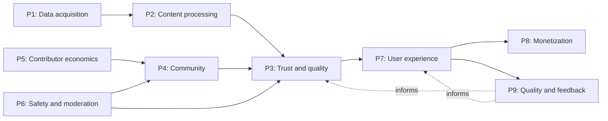

# 02 — Pillars

> **Purpose:** define pillars as the durable, product-level capability layers that bridge strategy and execution. Pillars are how a product gets built; epics and items deliver against them.

If [strategy](01_strategy.md) is *why and what,* and epics are *when and by whom,* pillars are *what the product needs to be capable of, layer by layer.* They are evergreen, sequentially dependent, and each one is concrete enough to build from.

---

## What a pillar is

A pillar is a vertical slice of the product covering a single capability domain.

Examples (generic categories, not project names):

- A *data acquisition* pillar — how the product gets its raw material in.
- A *content processing* pillar — how raw material becomes usable content.
- A *trust and quality classification* pillar — how the product knows what is good and what is not.
- A *user experience* pillar — how the product is presented to the end user.
- A *monetization* pillar — how the product makes money.
- A *feedback and quality loops* pillar — how the product learns from use.

Each is a capability the product must have. Each can be implemented incrementally — pillars are not "done in one go." But each is complete in concept: you can describe what it does, what feeds it, what it feeds, and what counts as a working version.

### What a pillar is not

- **Not a feature.** A feature is something the user can do. A pillar is a capability layer that enables features. ("Search" is not a pillar; "the indexing and retrieval capability that powers search" might be.)
- **Not a project.** A project is time-boxed. A pillar persists across many projects.
- **Not an epic.** An epic is a 3–12 week delivery container against one or more pillars (see [03_epics.md](03_epics.md)). An epic finishes. A pillar continues.
- **Not a microservice or module.** A pillar may span many services and many modules. Pillars are a *product* abstraction, not an *architecture* one. (They will often inform the architecture, but they do not equal it.)
- **Not a team.** Pillars are independent of team structure. A team may own multiple pillars; a pillar may be touched by multiple teams.

---

## Why pillars, not just epics

A backlog of epics alone is not enough.

- **Epics finish; pillars persist.** When epic E07 ships, the *monetization capability* of the product still exists and still evolves. Epic E12 may extend it; E18 may rework it. The pillar is the through-line; the epics are the deliveries.
- **Epics deliver against pillars.** When you start a new epic, you ask "which pillar does this advance?" — not "what's next on the list." The pillar provides the *why* for the epic's existence.
- **Pillars surface gaps.** A product with a strong data pillar and a weak feedback pillar will keep shipping epics that improve the strong side. Naming the pillars makes the imbalance visible.
- **Pillars sequence work.** Some pillars depend on others. Without naming them, you build downstream things on upstream foundations that do not exist yet.

The pillar layer exists because the gap between strategy ("become the X for Y") and epics ("deliver feature Z by next quarter") is too large to bridge directly. Pillars are the missing layer.

---

## How many pillars

Typical range: **5 to 12.**

- Fewer than 5: each pillar is too broad to grep, too vague to anchor decisions. "The product" is not a pillar.
- More than 12: pillars overlap, become hard to remember, and stop being a useful mental model. The team will start treating them as a feature list.

Each pillar must be:

- **Distinct enough to grep.** When someone asks "which pillar does X advance?" the answer is one pillar, not three.
- **Complete enough to stand alone.** A pillar doc that requires reading three other pillars to make sense is too tangled. Split or merge.
- **Named with a noun phrase.** "Data acquisition," not "acquire data." Pillars are capabilities, not actions.
- **Numbered (P1, P2, P3, ...).** Numbering provides stable references for cross-linking and grep.

### Sample pillar inventory (generic)

A common shape for a content-and-experience product:

| # | Pillar | What it covers |
|---|--------|----------------|
| P1 | Data acquisition | Sources, licensing, ingestion, validation. |
| P2 | Content processing | Enrichment, transformation, derivation. |
| P3 | Trust and quality | Source confidence, content quality classification, freshness. |
| P4 | Community and contribution | Inbound user content, reputation, incentives. |
| P5 | Contributor economics | Payout mechanics, revenue share, accounting. |
| P6 | Safety and moderation | Abuse, spam, compliance. |
| P7 | User experience | The product surface: presentation, interaction, accessibility. |
| P8 | Monetization | Pricing, tiers, conversion, billing. |
| P9 | Quality and feedback loops | Analytics, metrics, dashboards, learning. |

The set above is illustrative. Any given project will have its own pillar list. The shape — 5–12 noun-phrase capabilities forming a chain — is what generalizes.

---

## Sequential dependency

Pillars are not a flat set. They form a chain. Downstream pillars depend on upstream ones being implementable.



The diagram shows two things:

- **Solid arrows: enables.** P1 must be implementable before P2 makes sense. P3 must be defined before P7 can present trustworthy content.
- **Dotted arrows: informs.** P9 feedback loops *influence* upstream pillars but do not block them. The product can ship before P9 is mature; it just learns slower.

### Why order matters

If you build downstream pillars before upstream ones, two things happen:

1. **Downstream pillars get stuck.** P7 (user experience) cannot present trustworthy content if P3 (trust and quality) has no defined classification. You will improvise a classification scheme inside P7, and it will be wrong, and it will be expensive to undo.
2. **Upstream pillars get distorted.** When P3 finally gets its proper design, P7's improvised classification has to be retrofitted. The improvisation has accumulated dependencies. The retrofit becomes a multi-epic project.

The cost of building out of order is paid later, with interest. Naming the order in the pillar layer is how you avoid the cost.

### Reading the chain

The chain is most useful as a *reading order* for someone new to the product. Start at P1; each subsequent pillar makes more sense for the pillars you have already read. The "Next: P_N+1" footer convention (below) reinforces the reading order.

---

## Pillar doc structure

Every pillar gets its own document at `docs/pillars/P<N>_<short_name>.md`. The structure is consistent across pillars so the set is readable.

### Required sections

1. **Pillar goal** (italicized, top of doc). One sentence. The capability this pillar represents.
2. **Numbered sections (§1, §2, ...)** with concrete subsections. Use Arabic numerals. The structure mirrors a reference manual — readers should be able to cite "P3 §2.4."
3. **Tables as primary artifacts.** Inventories of sources, field mappings, state machines, configuration matrices, scoring weights — table them. Prose is for framing, not specification.
4. **Mermaid diagrams** for flows and state machines. The data pipeline. The state diagram of an item moving through the pillar's machinery. The dependencies among the pillar's internal components.
5. **Implementation details: schemas, API examples, storage layouts.** Concrete enough to build from. If a developer cannot start an implementation from the pillar doc, the doc is too abstract.
6. **"Next: P_N+1" footer.** Links the chain. The reader knows where to go next.

### What goes in §1, §2, ...

There is no universal section template. Pillars differ in shape. Common patterns:

- **§1 Overview** — what the pillar does, what it depends on, what it feeds.
- **§2 Inventory** — the things the pillar manages (sources, content types, state types).
- **§3 Flow** — the pipeline or process. Mermaid diagram, then prose per stage.
- **§4 Schema** — data model, types, constraints.
- **§5 API / interfaces** — how the rest of the product talks to this pillar.
- **§6 Configuration** — knobs the operator can turn (with defaults).
- **§7 Operations** — how to run, monitor, troubleshoot.

Adapt to the pillar. A monetization pillar will have heavy sections on pricing tiers, conversion logic, and billing integration; an operational pillar will lean heavier on schemas and runbooks.

### Headings, not paragraphs

Use headings liberally. A pillar doc with five top-level sections and 30 subsections is normal. Long flat sections are harder to navigate and harder to cross-reference.

---

## Versioning

Pillars are **living documents** — unlike strategy snapshots. The pillar doc is the current best understanding of how that capability layer works. Update it as the design evolves.

But not all changes are equal:

- **Small refinements** — fixing a field name, adjusting a default, clarifying a sentence — go directly into the doc. Update the "Last updated" timestamp.
- **Material design changes** — replacing a scoring scheme, restructuring a pipeline, changing the data model — use the refinement pattern below. Do not overwrite; supersede.

### The "last updated" line

Every pillar doc carries a single-line timestamp near the top:

```markdown
> **Pillar goal:** <one sentence>
>
> **Last updated:** YYYY-MM-DD
```

The timestamp is updated on every meaningful edit. It is the freshness signal for readers.

---

## The refinement pattern

When a pillar's design materially evolves — enough that the existing sections describe a *superseded* model — do not overwrite the pillar doc. Instead:

1. **Write a separate refinement doc** at `docs/architecture/architecture_refinement_vN.md` (or a similar path the project agrees on). The refinement doc describes the new design in full.
2. **Mark the superseded sections in the original pillar doc** with a banner pointing at the refinement. Keep the original prose intact below the banner — readers can still see the old design and understand why a particular legacy choice was made.
3. **Cross-link from the refinement to the pillar** so a reader who lands on the refinement knows which pillar it modifies.

### Why this matters

Overwriting destroys context. Two weeks after a redesign, somebody asks "why does the database have this column we don't seem to use?" The answer was in the old pillar doc. Overwritten, it is now lost to git history alone — which is a poor place to find decisions.

Refinement docs preserve the audit trail without forcing readers to dig through git. The current design is on top; the prior design is right below; the reason for the change is in the version history of the refinement doc itself.

### Superseded section banner template

Paste this above a superseded section in the original pillar:

```markdown
> [!IMPORTANT]
> **Superseded.** The design below describes the original model. The
> current model is defined in
> [architecture_refinement_vN.md](../architecture/architecture_refinement_vN.md).
> The original content is retained for audit; do not implement from it.
```

The banner is opinionated on purpose: it must be impossible to miss, and it must point clearly at the live source of truth. Subtle banners get ignored.

### When NOT to use the refinement pattern

- A typo. Just fix it.
- A renamed field. Find-and-replace in the pillar doc, bump the timestamp.
- A clarification with no design change. Edit in place.

The refinement pattern is for *changes a reader could miss if you just edited in place.* If your change is small enough that direct edit is safe, edit directly.

---

## Cross-references

Every pillar links outward. A pillar without cross-references is an island; an island is unmaintained.

### What to link to

- **Strategy docs the pillar operationalizes.** A pillar exists to deliver some part of the strategy. Name it. (See [01_strategy.md](01_strategy.md).)
- **Epics that deliver against this pillar.** Live, planned, and done epics — at least the ones currently relevant. (See [03_epics.md](03_epics.md).)
- **Sibling pillars this one depends on or feeds.** Make the chain explicit.
- **Refinement docs that supersede sections (if any).**
- **External references** — academic papers, RFCs, third-party docs, standards — where they are foundational to the pillar's design.

### Where to put the links

- At the top of the pillar doc, under the goal/timestamp: a short "Related" block linking strategy, dependencies, and refinements.
- At the foot of each major section: links to specific sibling pillar sections if they are tightly coupled.
- At the very end of the doc: the "Next: P_N+1" footer.

---

## Pillar doc skeleton (full template)

Paste this as the starting point for a new pillar doc at `docs/pillars/P<N>_<short_name>.md`:

```markdown
# P<N> — <Pillar name>

> **Pillar goal:** <one sentence. The capability this pillar represents.>
>
> **Last updated:** YYYY-MM-DD

**Related:**
- Strategy: [Business model](../strategy/04_business.md)
- Depends on: [P<N-1> — <name>](P<N-1>_<short_name>.md)
- Feeds into: [P<N+1> — <name>](P<N+1>_<short_name>.md)
- Delivering epics: E<NN>, E<NN>, E<NN>

## 1. Overview

<What this pillar does. What it depends on. What it feeds. One or two
paragraphs. Should be enough that a reader who reads only §1 has the
right mental model.>

## 2. <Inventory or core concept>

<Table preferred. The set of things the pillar manages.>

| Column A | Column B | Column C |
|----------|----------|----------|
| ... | ... | ... |

## 3. <Flow / pipeline / state machine>


### 3.1 <Stage 1 details>

<Prose + table describing the stage's inputs, outputs, behavior.>

### 3.2 <Stage 2 details>

<...>

## 4. <Schema / data model>

```sql
CREATE TABLE ...
```

| Field | Type | Purpose | Constraints |
|-------|------|---------|-------------|
| ... | ... | ... | ... |

## 5. <Interfaces / API>

<HTTP routes, message contracts, function signatures — whatever the
rest of the product uses to talk to this pillar.>

## 6. <Configuration>

| Knob | Default | Purpose |
|------|---------|---------|
| ... | ... | ... |

## 7. <Operations / runbook>

<How to monitor. What metrics matter. How to troubleshoot common
failure modes.>

---

**Next:** [P<N+1> — <name>](P<N+1>_<short_name>.md)
```

---

## Mermaid example for a typical pillar flow

Copy and adapt:

```mermaid
flowchart LR
  IN[<input source>] --> VALIDATE[Validate]
  VALIDATE -->|valid| TRANSFORM[Transform]
  VALIDATE -->|invalid| REJECT[(Rejection log)]
  TRANSFORM --> CLASSIFY[Classify]
  CLASSIFY --> STORE[(Storage)]
  STORE --> SERVE[Serve to downstream pillar]
  STORE -.->|metrics| METRICS[(P9: Feedback)]
```



The diagram conveys:

- The shape of the pipeline at a glance.
- Which stages are *transforms* (rectangles) and which are *stores* (rounded brackets).
- Which arrows are mainline flow (solid) and which are auxiliary signals (dotted).
- How this pillar feeds downstream pillars or stores.

A pillar with no diagram is harder to read than a pillar with one. If the pillar has any flow, give it a diagram.

---

## How pillars connect to the rest of the methodology

- **Strategy → Pillars** ([01_strategy.md](01_strategy.md)). Pillars exist to deliver strategy. Every pillar's "Related" block names the strategy doc it operationalizes.
- **Pillars → Epics** ([03_epics.md](03_epics.md)). Every epic charter names one primary pillar. The pillar's "Related" block lists the epics currently delivering against it.
- **Pillars → Items** ([04_backlog_items.md](04_backlog_items.md)). Every backlog item names a pillar in its frontmatter. This allows `rg "Pillar: P<N>" backlog/` to surface all items advancing a given pillar across all epics.
- **Pillars → Working Principles** ([06_working_principles.md](06_working_principles.md)). Pillar docs are themselves changes; the same surgical-change and simplicity-first principles apply when editing them.
- **Pillars → DoD** ([07_definition_of_done.md](07_definition_of_done.md)). Doc updates that are user-facing or behavior-altering pass the documentation gate of the DoD.

---

## Common mistakes when writing pillar docs

| Mistake | Fix |
|---------|-----|
| Pillar is a feature in disguise ("the search pillar"). | Rename to the underlying capability ("indexing and retrieval pillar"). |
| Two pillars cover overlapping territory. | Merge or sharpen the boundary. Each topic has one home. |
| Pillar doc is all prose, no tables. | Convert inventory and configuration claims into tables. |
| Pillar has no diagram and has obvious flow. | Add a mermaid flowchart. |
| Pillar lacks dependency arrows in the chain diagram. | Add the upstream and downstream pillar references. |
| Pillar was edited heavily but "Last updated" was not bumped. | Bump the timestamp on every meaningful edit. |
| Material design change overwrote prior sections. | Recover from git history. Establish the refinement pattern going forward. |
| Banner for superseded sections is missing. | Add the banner — readers must not be able to miss it. |
| "Next: P_N+1" footer missing. | Add it. Reading order is one of the pillar layer's main features. |
| Pillar refers to "the user" without specifying which kind. | Name the actor: visitor, contributor, operator, paying user, etc. |

---

## Authority

Pillars are bound by strategy. If a pillar's design contradicts the strategy it operationalizes, the strategy wins — but the contradiction should be surfaced, because the strategy may need to evolve too.

Pillars constrain epics. An epic that contradicts a pillar's design must either change to comply or trigger a pillar refinement. Either is fine; silently violating a pillar is not.

Pillars do not bind code-style choices, framework selections, or specific library use. Those are below the pillar layer. A pillar specifies *what* the capability is and *how* it behaves at a product level; the implementation choices are at the architecture layer.

---

**Next:** [03 — Epics](03_epics.md)
