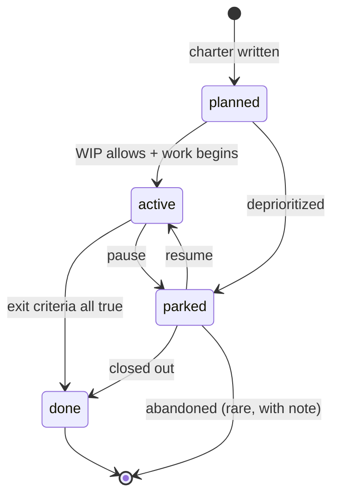

# 03 — Epics

> **Purpose:** define epics as time-boxed (3–12 week) delivery containers that group backlog items around a coherent outcome. Each epic advances one primary [pillar](02_pillars.md) and is closed by a binary exit-criteria check.

If pillars are durable capability layers, epics are the *batches of work* that build them out. An epic is bigger than an item and smaller than a pillar; it has a charter, an owner, exit criteria, and a finite lifespan.

---

## What an epic is

An epic is a delivery unit with:

- **A coherent outcome.** When the epic is done, a specific change in the product or its capability layer is visible. The outcome can be stated as a single sentence in jobs-to-be-done form (see below).
- **A bounded scope.** The epic names what is in and — equally important — what is out. Out-of-scope items are routed to other epics, not silently included.
- **Binary exit criteria.** A short checklist of conditions that must all be true for the epic to be marked done. No subjective gates ("looks good"); only checkable ones.
- **A primary pillar.** One pillar that the epic advances most. The epic may touch others; only one is primary.
- **A duration on the order of 3–12 weeks.** Shorter than that and it is probably an item or a small group of items; longer than that and it should be split into multiple epics.
- **A directory.** Each epic has its own folder containing charter, active backlog, archive, future-deferred items, and epic-specific tests (see Directory Layout below).

### What an epic is not

- **Not a feature.** A feature might span multiple epics, or be one item within an epic. Epics are larger or differently-shaped than features.
- **Not a sprint.** Sprints are time-boxed iterations, often two weeks, often containing work from multiple epics. An epic is scope-bounded; a sprint is time-bounded.
- **Not a project.** A project is open-ended and may contain multiple epics. An epic is closable.
- **Not a pillar.** A pillar is evergreen; an epic is finite.

---

## One pillar primary, multiple secondary

Every epic charter names exactly one **primary pillar.** This is the pillar the epic most clearly advances. The epic *may* touch other pillars, but the primary anchor is single.

### Why a single primary

- It forces a clear answer to "why are we doing this epic?" The answer is "because [primary pillar] needs [outcome]."
- It allows pillar-level rollups: which pillars are getting attention this phase? Which are starved? A multi-pillar primary obscures this signal.
- It simplifies prioritization across epics. When two epics compete for resources, the comparison is "advancing pillar X versus advancing pillar Y" — not "this one touches three pillars, the other touches four."

### When an epic seems to span two pillars equally

That is usually a sign the epic is too large. Split it. Each resulting epic should have a clear primary.

If splitting genuinely is not possible (the work is integrated by nature), pick the pillar whose *most critical* capability is being delivered. The other pillar becomes a "Secondary" link in the charter.

---

## WIP limit

Cap the number of simultaneously **active** epics. Typical cap: **3.**

The reason is not bureaucratic. Too many active epics produces a predictable failure mode:

- Each epic gets fractional attention.
- Items inside each epic move slowly because contributors switch context constantly.
- No epic finishes; the team has many "almost done" things and no closures.
- Stakeholders cannot tell what is actually in flight.

Three active epics is a generous cap for most teams. Smaller teams should run fewer; larger teams *with truly independent workstreams* can run more, but should still cap explicitly.

### What "active" means

An epic is *active* when work is actively progressing on its items. An epic that has not seen any item state change for two weeks is not active — it is either parked or done in everything but name. Audit the active set monthly.

### Transitioning into active

To move an epic from `planned` to `active`, the WIP cap must allow it. If three epics are already active, you cannot start a fourth without first closing or parking one of the existing three. This forces an explicit decision: which epic is more valuable to finish now?

Without this gate, "active" loses meaning.

---

## Standard epic-folder structure

Each epic gets its own folder at `backlog/epics/E<NN>-<slug>/`. The folder contains a fixed set of five files:

```
backlog/
  README.md                                  # backlog workflow doc (project-level)
  EPICS.md                                   # rollup table (see below)
  TEST_BACKLOG.md                            # cross-epic manual-QA queue (optional)
  epics/
    E<NN>-<slug>/
      README.md                              # the epic charter
      BACKLOG.md                             # active items (open, ready, in-progress, etc.)
      ARCHIVE.md                             # completed and rejected items
      FUTURE.md                              # items deferred to a later phase (P3 / nice-to-have)
      TEST.md                                # epic-specific acceptance + regression scenarios
```

The five per-epic files are the **standard pattern**. An epic should ship all five even if some start empty — the empty-but-present file signals to contributors "this surface exists; add to it." Empty files are cheap; missing files force every new contributor to re-derive the convention.

### File roles

- **`README.md` — the charter.** The single source of truth for what this epic is, why it exists, and when it is done. The full template is below.
- **`BACKLOG.md` — active items.** Every item in the epic that is not yet `done` lives here. Items are added when filed and moved out when archived or deferred. The format of individual items is defined in [04_backlog_items.md](04_backlog_items.md).
- **`ARCHIVE.md` — completed items.** When an item passes the [Definition of Done](07_definition_of_done.md) and is marked `done`, it moves here. Also receives `rejected` items. Archives are append-only; do not edit history.
- **`FUTURE.md` — deferred items.** P3 / nice-to-have items that are real but not in scope for the current phase. Items here use either monotonic `BL-####` IDs (Scheme A) or epic-scoped `BL-E<NN>-F##` IDs (Scheme B) per [04_backlog_items.md "FUTURE.md numbering"](04_backlog_items.md#futuremd-numbering-two-valid-schemes).
- **`TEST.md` — epic-specific test scenarios.** Two-table format: acceptance tests mapping to exit criteria + regression scenarios to protect. Per-item tests live in the item bodies (`Test:` field); TEST.md holds the epic-scoped scenarios that span multiple items or need manual QA. Template below.

### The cross-epic `TEST_BACKLOG.md` (optional)

Some projects also keep a `backlog/TEST_BACKLOG.md` at the backlog root for **cross-epic manual-QA scenarios** — tests that span ≥ 2 epics, or that operators run on a cadence before milestone declarations. Each epic's `TEST.md` covers epic-scoped scenarios; `TEST_BACKLOG.md` covers the rest. Skip it for small projects where the per-epic TEST.md files are sufficient; add it when QA volume justifies a central queue.

### Why per-epic folders

- Items live where the epic lives. Picking up an epic means opening one folder.
- Cross-epic queries still work via grep across `backlog/epics/`.
- Closing an epic compresses cleanly: archive the folder or mark it `done` in the rollup; the directory remains intact for audit.

### Naming convention: `E<NN>-<slug>`

The folder name has two parts:

1. **`E<NN>`** — epic ID with the literal `E` prefix and a 2-digit zero-padded number (`E01`, `E02`, …, `E12`). The `E` prefix prevents collisions with item numbering and makes greps for "epic 7" unambiguous (`rg "E07"` vs `rg "07"` matching everything from item numbers to dates).
2. **`<slug>`** — short kebab-case identifier under ~30 characters. Descriptive but tight: `city-expansion` not `expansion-of-cities-to-new-locations`.

Together: `E01-city-expansion`, `E02-ai-enrichment`, `E11-open-beta-launch`. Numbering matches the epic ID in `EPICS.md`: `E07` in the rollup → `E07-content-protection` on disk.

---

## TEST.md template

`TEST.md` is a standard per-epic file (recommended for every epic; required when the epic's exit criteria need verification beyond what individual item tests cover). It holds the structured test inventory: acceptance scenarios mapping to exit criteria + regression scenarios to protect on every change.

The template is two or three tables:

```markdown
# E<NN> — <Epic name> — Test scenarios

_Epic-specific acceptance + regression scenarios. The cross-epic
manual-QA queue lives in [../../TEST_BACKLOG.md](../../TEST_BACKLOG.md)._

## Acceptance tests for exit criteria

| ID    | Scenario                                                     | Status     |
|-------|--------------------------------------------------------------|------------|
| AT-01 | <Scenario verifying a binary exit criterion from the charter>| not-run    |
| AT-02 | <Scenario verifying a binary exit criterion>                 | pass       |

## Regression scenarios to protect

| Area              | Scenario                                              | Last verified  |
|-------------------|-------------------------------------------------------|----------------|
| <surface or flow> | <what to keep working as the epic evolves>            | YYYY-MM-DD     |

## Manual-QA scenarios (operator-driven, optional)

| Scenario                                            | Cadence              | Notes |
|-----------------------------------------------------|----------------------|-------|
| <Scenario that can't be cheaply automated>          | Per minor release    | <why manual> |
```

### When to use TEST.md

- **Exit criteria need verification beyond what individual item tests cover.** End-to-end flows that span multiple items, integration tests that exercise the epic's outputs as a whole.
- **The epic touches a surface where regressions have happened before.** Capture the failure modes; re-test on every meaningful change.
- **Default position:** include TEST.md as a standard per-epic file. Empty-but-present is fine while the epic is early; populated as the epic accrues exit criteria + items.

### When `TEST.md` can be empty (but should still exist)

- The epic is small enough that a few sentences in the charter cover verification needs.
- The project's testing approach already covers the epic's scope through automated suites.

Even in those cases, ship an empty `TEST.md` with the two/three table headers. An empty-but-present file signals "this surface exists; add to it as the epic grows" — missing files force every new contributor to re-derive the convention.

### Conventions

- **Acceptance-test IDs:** `AT-##` (epic-scoped, monotonic — separate counter per epic). Cross-epic QA in `TEST_BACKLOG.md` uses `QA-##`.
- **Status column** mirrors the [Test enum](04_backlog_items.md#test-enum): `not-run` / `pending` / `partial` / `pass` / `fail: <detail>` / `manual-verified` / `n/a`.
- When an acceptance test maps to a closed item, cite the item ID in the Status column (e.g., `pass — BL-0428`).
- Regression scenarios are append-only after first inclusion — never delete; mark `deprecated` if no longer relevant.

The file is part of the epic folder. When the epic closes, `TEST.md` is the audit record of what was verified to support the exit-criteria sign-off.

---

## Epic charter template

The `README.md` inside each epic folder is the charter. The template below is the canonical shape. Paste it verbatim into a new epic and fill in the placeholders.

```markdown
# E<NN> — <Epic title>

**Pillar (primary):** P<#> — <pillar name>
**Pillar (secondary, optional):** P<#> — <pillar name>
**Status:** planned | active | done | parked
**Phase:** Phase <#>
**Started:** — (or YYYY-MM-DD once Status flips to active)
**Target close:** YYYY-MM-DD or TBD
**Owner:** <human role> + <agent role>

## Outcome (jobs-to-be-done)

When <actor> <context>, they want <goal>, so <benefit>.

## Exit criteria (binary)

- [ ] <Criterion 1 — specific, falsifiable, checkable>
- [ ] <Criterion 2 — specific, falsifiable, checkable>
- [ ] <Criterion 3 — specific, falsifiable, checkable>

## KPIs

- <Measurable outcome 1, with target>
- <Measurable outcome 2, with target>

## Out of scope

- <Related work routed to another epic, with pointer>
- <Related work explicitly deferred to FUTURE.md, with pointer>

## Linked docs

- Pillar(s): [P<#> — <name>](../../docs/pillars/P<#>_<name>.md)
- Strategy: [<topic>](../../docs/strategy/<NN>_<topic>.md)
- Refinements (if any): [<refinement>](../../docs/architecture/<refinement>.md)
- Related epics: E<NN>, E<NN>

## Item roster

See [BACKLOG.md](BACKLOG.md) for active items, [ARCHIVE.md](ARCHIVE.md)
for completed, [FUTURE.md](FUTURE.md) for deferred.
```

### Filling the template — section by section

#### Pillar primary and secondary

- Always exactly one primary.
- Secondary is optional. If you find yourself listing three or more, the epic is too broad.
- Both fields point at the pillar's doc path.

#### Status

- `planned` — charter exists, items may be filed, but work has not started.
- `active` — work in progress; counts against the WIP limit.
- `done` — all items closed, exit criteria met, charter frozen.
- `parked` — work halted (priorities shifted, blocker appeared, etc.). Differs from `done` because the exit criteria are not met. Parked epics can resume; charter is preserved.

#### Phase

The phase from the strategy roadmap (see [01_strategy.md](01_strategy.md)). An epic belongs to exactly one phase. If an epic spans phases, it should usually be split at the phase boundary.

#### Started, Target close

- `Started` is the date the epic moved to `active`. Use `—` while in `planned`.
- `Target close` is the date by which the team intends the epic to be `done`. Use `TBD` if not yet committed. Adjust if the estimate changes; do not erase the original — note the change in the charter's history.

#### Owner

Name the human role (e.g., "product lead," "tech lead") and the agent role (e.g., "AI coding agent") responsible for execution. Roles, not people; the people may change but the role persists for the epic's lifetime.

#### Outcome (jobs-to-be-done)

A single sentence in the canonical JTBD form: "When [actor] [context], they want [goal], so [benefit]." This is the heart of the charter. It is the answer to "what does this epic deliver?"

Examples (generic):

- "When a new content batch is ingested, operators want it to flow through enrichment automatically with minimal manual cleanup, so the content layer scales faster than alternatives."
- "When a user finishes a session, they want to be invited to return without feeling pushed, so retention grows without harming first impressions."

Note the pattern: actor, situation, desired outcome, business benefit. All four elements must be present. Vague actors ("the user") or vague situations ("when using the app") signal that the epic is not yet sharp enough.

#### Exit criteria (binary)

Three to seven checkboxes, each of which:

- Is *specific:* you can tell whether it is satisfied or not by looking at a deliverable.
- Is *falsifiable:* it could fail. If every reasonable result counts as success, the criterion is not real.
- Is *checkable:* there is a way to verify it (a test, a metric reading, a piece of shipped functionality).

"Improves quality" is not a criterion. "Median time-to-result drops below 200ms in the integration test suite" is.

If the epic genuinely cannot enumerate criteria, the epic is not ready to start. Charter it more carefully or break it into smaller, sharper epics.

#### KPIs

The measurable outcomes that prove the epic worked, *not* the exit criteria. KPIs may extend beyond the epic's close date (e.g., "30-day retention after Phase 2 launch ≥ X%"). Two or three is the right number. More than five and the epic is unfocused.

KPIs differ from exit criteria. Exit criteria gate closure ("the integration test runs and passes"); KPIs measure success after closure ("the feature drives a measurable lift").

#### Out of scope

Explicit. Pointed.

- *"Editorial review tooling — out of scope; see the E10 — Quality Ops epic in your project's backlog."*
- *"Internationalization beyond the default language — deferred; see [FUTURE.md](FUTURE.md)."*

The list should pre-empt scope creep. Whenever a reviewer or contributor asks "shouldn't we also do X?" the answer should already exist in this section.

#### Linked docs

- Pillar(s) — link to the doc file.
- Strategy — the strategy doc(s) the epic operationalizes.
- Refinements — any architecture refinement docs that supersede pillar sections this epic touches.
- Related epics — sibling epics that share scope-boundaries.

Links are absolute (within the repo). They must resolve. A broken link in a charter is a tax on every future reader.

---

## Status enum

The four allowed values:

| Status | Meaning | WIP cap counts? |
|--------|---------|------------------|
| `planned` | Charter exists; items may exist; work has not started. | No |
| `active` | Work in progress on the epic's items. | Yes |
| `done` | All items archived; exit criteria met; charter frozen. | No |
| `parked` | Work halted before completion; exit criteria not met; can resume. | No |

### Transitions

```
planned ──┬──> active ──┬──> done
          │             │
          │             └──> parked ──> active   (resume)
          │                          └──> done   (close out, exit criteria met somehow)
          │
          └─────────────────────> parked   (deprioritized before starting)
```

### Rules

- A `planned` epic with no items for several months should be reviewed: still worth doing? If not, move to `parked` or document the decision.
- An `active` epic with no item state change for two weeks should be audited: is the team actually working it? If not, move to `parked` and free up the WIP slot.
- Closing an epic to `done` requires every exit-criteria checkbox to be true. If any are false, the epic stays `active` or `parked`. Do not move to `done` and leave open boxes.
- A `parked` epic is *not* abandoned — its charter is preserved, its items remain in `BACKLOG.md` (or move to `FUTURE.md` if the pause is long). It can resume cleanly.

---

## Epic rollup (`EPICS.md`)

A single file at `backlog/EPICS.md` is the at-a-glance index of every epic. It is the first thing a new contributor or stakeholder reads to understand the state of work.

### Rollup table template

```markdown
# Epics

Last updated: YYYY-MM-DD

| ID   | Title             | Pillar | Status   | Phase | Open / Done | Next milestone                   | Owner            |
|------|-------------------|--------|----------|-------|-------------|----------------------------------|------------------|
| E01  | <Epic title>      | P1     | done     | 1     | 0 / 14      | (closed)                         | product + agent  |
| E02  | <Epic title>      | P2     | active   | 2     | 7 / 22      | <next visible shipment>          | product + agent  |
| E03  | <Epic title>      | P3     | active   | 2     | 4 / 11      | <next visible shipment>          | product + agent  |
| E04  | <Epic title>      | P9     | active   | 2     | 6 / 9       | <next visible shipment>          | product + agent  |
| E05  | <Epic title>      | P7     | planned  | 2     | 0 / 0       | <first item to land>             | product + agent  |
| ...  | ...               | ...    | ...      | ...   | ...         | ...                              | ...              |
```

### Update discipline

Update the rollup whenever any of the following happens:

- An epic changes status.
- An item moves between `BACKLOG.md` and `ARCHIVE.md` (the `Open` and `Done` counts shift).
- A new epic is added.

Stale counts erode trust. If `EPICS.md` says 7 open and there are 4, contributors stop believing the rollup. Keep it honest.

### Active count vs. WIP limit

The WIP limit is enforced by counting rows where `Status` is `active`. If that count would exceed the cap with a new `active` row, the transition is blocked until another active epic closes or parks.

---

### Pillar Coverage (inverse view)

Below the per-epic rollup, include a small "Pillar Coverage" table — the inverse view of the per-epic primary-pillar field. It answers "which epics are currently advancing pillar X?" in one glance.

```markdown
## Pillar Coverage

| Pillar                          | Epics touching it          |
|---------------------------------|----------------------------|
| P1 <pillar name>                | E01                        |
| P2 <pillar name>                | E01, E02                   |
| P3 <pillar name>                | E03                        |
| P4 <pillar name>                | E06                        |
| ...                             | ...                        |
```

Useful for:

- **Pillar audits.** "Which pillars are getting attention this phase? Which are starved?"
- **Cross-epic coordination.** "Both E03 and E07 touch P8 — should they coordinate?"
- **Strategic re-evaluation.** When the strategy re-evaluation protocol runs (see [01_strategy.md](01_strategy.md)), this table shows where execution capacity is actually going.

The table is hand-maintained alongside the rollup. When an epic is added, removed, or changes primary pillar, both update.

### Last-refresh metadata

A short "Last refresh" note at the top of the rollup makes the file's freshness visible at a glance and lets readers see what changed since the last sweep:

```markdown
> **Last refresh:** YYYY-MM-DD — <one-paragraph summary of what shipped since last refresh, what's currently in flight, and any known drift between summary counts and per-item state>.
```

When stale counts accumulate (a common backlog failure mode), the next refresh notes the drift explicitly and resets the table to ground truth.

---

## Epic lifecycle

The path an epic takes from creation to close:



### Stage detail

**`planned`.** The charter is written. Items can be filed against the epic (status `backlog` or `ready` per [04_backlog_items.md](04_backlog_items.md)). No items are `in-progress`. The epic is not consuming a WIP slot.

**`active`.** Work has begun. At least one item should be `in-progress` or progressing toward done. The WIP slot is consumed. The rollup reflects open/done counts.

**`done`.** Every exit-criteria checkbox is true. Every item in the epic is in `ARCHIVE.md` (status `done` or `rejected`), with `FUTURE.md` containing any explicitly-deferred items. The charter is frozen — no more substantive edits. Subsequent work touching the same pillar starts a new epic.

**`parked`.** Work has paused without meeting exit criteria. Items are still in `BACKLOG.md` (or moved to `FUTURE.md` if the pause is expected to be long). The WIP slot is free.

### Closing an epic — the close-out checklist

```markdown
Closing E<NN>:

- [ ] Every exit-criteria box in the charter is ticked.
- [ ] Every item in BACKLOG.md has been moved to ARCHIVE.md or FUTURE.md.
- [ ] BACKLOG.md is empty (only a placeholder line, if any).
- [ ] Pillar's "Delivering epics" list updated (this epic moves to "Past").
- [ ] EPICS.md rollup status flipped to `done`; counts final.
- [ ] If the epic produced new conventions or hard rules, those are
      captured in the project instruction file (see 08_lessons_and_memory.md).
```

The close-out is a deliberate event, not a passive drift. Doing it cleanly preserves the audit trail and signals to the team that the epic is *over.*

---

## Out-of-scope discipline

Scope creep is the predictable enemy of every epic. The defense is structural: name what is out of scope explicitly, and route it visibly.

### The "out of scope" section in the charter

Every charter has this section. It is not optional. If you cannot name anything that is out of scope, you have not bounded the epic enough — every charter has natural neighbors of work that *could* be included and are not.

The section answers two questions for each excluded item:

1. *What is excluded?* Be specific — a feature name, a behavior, a surface.
2. *Where does it go instead?* Pointer to another epic, to `FUTURE.md`, or an explicit "we will not do this."

### When a contributor asks "should we also do X?"

Three possible answers:

1. **Already in scope.** Point at the relevant items in `BACKLOG.md`.
2. **Already out of scope.** Point at the "Out of scope" section of the charter. Refer to the destination (other epic / `FUTURE.md`).
3. **Genuinely new — not currently scoped.** Charter discussion: should it be added? Adding requires updating the exit criteria and re-estimating target close. Most of the time the answer is "not now; file in `FUTURE.md`."

Without this discipline, epics absorb every adjacent suggestion and never finish.

### "Out of scope" examples

```markdown
## Out of scope

- Editorial review tooling — out of scope; see the E10 — Quality Ops epic in your project's backlog.
- Per-language voice catalog beyond the default — deferred; see [FUTURE.md](FUTURE.md).
- Migration of legacy content to the new schema — out of scope; one-off
  migration handled by [E04 — Legacy Migration](../04-legacy-migration/README.md).
- Multi-region deployment — out of scope for this phase entirely; revisit
  in Phase 3 planning.
```

Each line names *what* and *where it goes.* The reader leaves the section confident about the boundary.

---

## Pre-epic planning (the "incubation" phase)

Some work needs design before it can be chartered as an epic. The strategy is too abstract; the exit criteria can't yet be written; the right scope isn't yet visible. Forcing a charter at this stage produces vague exit criteria, which produces drifting epics.

The solution: a planning phase between strategy/pillars and epic chartering.

### What a planning doc is

A planning doc is a pre-charter design artifact. It lives at `docs/planning/<topic>.md` (or wherever your project routes design work).

It captures:

- **The problem in detail.** What user need or system limitation drives this work?
- **The proposed approach.** Architecture, data model, API contracts, integration points.
- **The open questions.** What's not yet decided and what input is needed to decide.
- **The estimated shape.** Rough effort, rough team, rough timeline — to inform whether this becomes one epic or several.
- **The graduation criteria.** When is this design concrete enough to charter as an epic?

### Why this is its own layer

The four planning layers (strategy, pillars, epics, items) all have crisp definitions and binary states. Design work doesn't fit any of them:

- It's bigger than an item (you can't write `Done means:` for a design exploration).
- It's not yet an epic (no binary exit criteria; the design itself is the deliverable).
- It's not a pillar (pillars are durable capabilities; planning docs are time-bounded explorations).
- It's not strategy (strategy is the *why*; planning is the *how-might-we*).

Naming this layer prevents two failure modes: (1) design work that never happens because there's no place for it, and (2) epics that ship with vague scope because the design wasn't finished before the charter.

### Graduation from planning to epic

A planning doc graduates to an epic charter when:

- The approach is concrete enough that binary exit criteria can be written.
- The open questions are answered or explicitly deferred.
- The scope is bounded enough to fit in the 3–12-week epic window.

When the planning doc graduates, charter the epic per the template above. Link back to the planning doc from the epic charter's "Linked docs" section — the planning doc remains the historical record of *why* the epic took the shape it did.

### Phase tagging

Planning docs typically carry a phase tag (e.g., `phase2-beta`, `phase3-growth`) so it's clear which strategic phase the work serves. When a phase closes, planning docs from that phase move to an `_archive/` subfolder; they remain reachable for audit.

### Not every epic needs a planning doc

Small, well-understood epics can charter directly. Use planning when:

- Multiple competing approaches need evaluation.
- The data model or API contract isn't obvious.
- Integration with other systems is non-trivial.
- The team has differing views on the right scope.

If the team has already aligned on the approach, skip planning and charter directly.

---

## How epics connect to the rest of the methodology

- **Strategy → Epics** ([01_strategy.md](01_strategy.md)). Every epic operationalizes part of strategy. The charter's "Linked docs" section names the strategy doc(s) and phase.
- **Pillars → Epics** ([02_pillars.md](02_pillars.md)). Every epic names one primary pillar. The pillar's "Related" block lists the epics currently delivering against it.
- **Epics → Items** ([04_backlog_items.md](04_backlog_items.md)). Items live inside epics. Items inherit the epic's pillar reference and contribute to the epic's open/done counts.
- **Epics → Definition of Done** ([07_definition_of_done.md](07_definition_of_done.md)). Closing an epic requires every item to have passed the DoD. There is no path from "items not all done" to "epic done."
- **Epics → Working Principles** ([06_working_principles.md](06_working_principles.md)). Epic charters are themselves changes; surgical-change discipline applies (do not edit charters as a side effect of unrelated work).

---

## Common mistakes when writing or running epics

| Mistake | Fix |
|---------|-----|
| Exit criteria are subjective ("looks good," "is improved"). | Replace with checkable conditions (a test passes, a metric crosses a threshold, a feature ships). |
| Outcome reads like a feature list, not JTBD. | Rewrite in canonical form: "When <actor> <context>, they want <goal>, so <benefit>." |
| Two epics share scope ambiguously. | Sharpen the boundary in both charters. Use the "Out of scope" section to point at each other. |
| Epic has been `active` for 14+ weeks. | Audit. Likely too big — split into multiple epics. Or genuinely stalled — park it. |
| Four epics are `active` and WIP cap is 3. | One must close or park before any further work continues on a fourth. |
| Rollup counts do not match `BACKLOG.md` reality. | Recount. Establish an update-on-state-change habit. |
| `BACKLOG.md` has items but charter exit criteria are blank. | Stop work. Write the criteria first; otherwise the epic has no stopping condition. |
| Closing an epic but `FUTURE.md` is empty when there are clearly deferred items. | Add the deferred items to `FUTURE.md` before closing. Future contributors need to find them. |
| Charter changed silently mid-epic. | Charters can change, but the change should be visible — note it at the top under "Charter history." Better still: bound the change to a re-chartering moment. |
| "Owner" lists specific people who left the team six months ago. | Use roles, not personal names. Roles persist; people change. |

---

## A worked (abstract) example of an epic charter

```markdown
# E07 — Content protection v1

**Pillar (primary):** P3 — Trust and quality
**Pillar (secondary, optional):** P6 — Safety and moderation
**Status:** active
**Phase:** Phase 2
**Started:** 2026-03-04
**Target close:** 2026-05-30
**Owner:** product lead + AI coding agent

## Outcome (jobs-to-be-done)

When operators publish content to paying users, they want it to be
resistant to unauthorized copying and redistribution, so the value
exchange of the paid tier is preserved and contributors are paid for
their work.

## Exit criteria (binary)

- [ ] All paid-tier content delivered via signed, expiring URLs.
- [ ] Audio assets watermarked at generation with a verifiable identifier.
- [ ] Watermark recovery tool runs against a sample and identifies the
      source contributor with 99% accuracy.
- [ ] Documented operator runbook for handling a suspected leak.
- [ ] Integration test exercises the full sign-deliver-revoke cycle.

## KPIs

- Verified leak incidents per 1000 paid users in the 90 days after
  rollout: target less than 2.
- Median sign-and-deliver latency under 150ms at the 95th percentile.

## Out of scope

- Hardware-based DRM. Not in this phase; revisit in Phase 4 if leak
  rates exceed target.
- Anti-screen-recording measures. Out of scope; see [FUTURE.md](FUTURE.md).
- Legal takedown workflow — out of scope; handled by
  [E11 — Legal Operations](../11-legal-ops/README.md).

## Linked docs

- Pillar: [P3 — Trust and quality](../../docs/pillars/P3_trust.md)
- Pillar: [P6 — Safety and moderation](../../docs/pillars/P6_safety.md)
- Strategy: [Business model](../../docs/strategy/04_business.md)
- Strategy: [Risk register](../../docs/strategy/09_risk.md)
- Related epics: [E11 — Legal Operations](../11-legal-ops/README.md)

## Item roster

See [BACKLOG.md](BACKLOG.md), [ARCHIVE.md](ARCHIVE.md), [FUTURE.md](FUTURE.md).
```

Note how every section is filled, every claim is checkable, every link resolves, and every reasonable adjacent question ("what about hardware DRM? what about takedowns?") has a pre-positioned answer.

---

## Authority

Epics are bound by their charter. Mid-epic scope changes should be recorded explicitly, not absorbed silently. If a change is large enough to affect the exit criteria, treat it as a re-chartering moment — discuss, decide, edit the charter, note the change at the top.

Epics are bound by the strategy phase. An epic cannot exit unless its work belongs to a phase that is still active. (If a phase closes mid-epic, finish the epic or park it; do not retroactively reclassify it into a different phase.)

Epics are bound by the WIP limit. Starting a new `active` epic when the cap is full requires another epic to close or park first. No exceptions; the cap exists because the failure mode of ignoring it is severe.

---

**Next:** [04 — Backlog items](04_backlog_items.md)
