# 04 — Backlog items

> **Purpose:** define the format, fields, states, and lifecycle of an individual work unit — the `BL-###` item. Items are the smallest atom of tracked work in this methodology. Every concrete change to the product corresponds to one or more items.

Items live inside epics (see [03_epics.md](03_epics.md)). Each item has a unique project-wide ID, a frontmatter table of structured fields, and a body of acceptance criteria and notes. They progress through a defined lifecycle, gated at the end by the [Definition of Done](07_definition_of_done.md).

---

## What a backlog item is

A backlog item is:

- **A unit of work sized for 1–2 weeks of effort at most.** Bigger than that and it should be split. Smaller than ~2 hours and it can usually be folded into a parent item, unless it has independent reviewability (e.g., a doc-only change).
- **Uniquely identifiable across the entire project.** Every item has an ID of the form `BL-###` where `###` is a monotonically increasing integer assigned at filing.
- **Owned by exactly one epic at a time.** The item lives in that epic's `BACKLOG.md` until it is `done` or `rejected`, at which point it moves to that epic's `ARCHIVE.md`.
- **Self-describing enough that a contributor who has never seen it can pick it up.** The item body answers: what is the problem, what is the approach, what does done look like, and where in the codebase is this work.
- **Trackable by simple text tools.** Markdown plus tables. Grep is the query engine. No external issue tracker required; if one is used, the local file is still authoritative.

---

## ID assignment

Item IDs are **monotonic and project-wide.**

- `BL-001` is the first item ever filed. `BL-1247` is the 1247th.
- IDs never repeat. A rejected item keeps its ID forever.
- IDs do not encode the epic. An item that moves between epics keeps the same ID. (Movement should be rare.)
- IDs are assigned at filing, by reading the highest existing ID in the project (e.g., `grep -roh 'BL-[0-9]\+' backlog/ | sort -t- -k2 -n | tail -1`) and incrementing.

### Why project-wide and not per-epic

- Cross-epic grep works: `rg "BL-0428" backlog/` finds the item regardless of which folder it now lives in.
- Cross-references in code, commits, and PRs are stable. A commit message referencing `BL-0428` always points at the same item, even if the item has been re-routed.
- Item moves between epics carry no renaming cost.

### Why monotonic and not random

- Monotonic IDs encode age. `BL-005` is older than `BL-503`. Useful for at-a-glance triage.
- Sortable. `ls`-able. Easier to scan in a long file.

### Zero-padding

Use three to four digits with zero padding (`BL-0001`, `BL-0042`, `BL-1247`). Keeps lexical sort matching numerical sort up to a sensible project size. Once a project exceeds 9999 items, widen the padding.

---

## FUTURE.md numbering: two valid schemes

Items in `FUTURE.md` (deferred to a later phase) can use one of two ID schemes. Pick one per project and stay consistent.

### Scheme A — monotonic, same as `BACKLOG.md`

Items in `FUTURE.md` use the same project-wide monotonic numbering as active items. Example: `BL-0428` lives in `FUTURE.md` until it's promoted to `BACKLOG.md`, at which point it keeps the same ID.

- *Pro:* every item has a stable, repo-wide identifier from the moment it's filed. Cross-references to the ID survive promotion.
- *Con:* the monotonic counter inflates with items that may never ship.

### Scheme B — epic-scoped, F-prefixed

Items in `FUTURE.md` use scoped IDs like `BL-E02-F01`, `BL-E02-F04`. When promoted to `BACKLOG.md`, the item is renumbered to a real `BL-###` from the monotonic counter.

- *Pro:* clear visual distinction between "filed but deferred" and "scheduled work."
- *Pro:* the monotonic counter only counts items that actually entered active scope.
- *Con:* identifier changes at promotion; any cross-references to the future-ID become stale at the moment of promotion.

Either is fine. The project picks one in its instruction file or backlog README and stays consistent. **Record the choice explicitly** — a one-line entry in `CLAUDE.md` / `AGENTS.md` / the backlog `README.md` saves every future contributor the cost of grepping `FUTURE.md` and guessing from the IDs they see. Mixing schemes inside the same project produces confusion.

---

## Item heading format

The item begins with a level-3 heading:

```markdown
### BL-### — <Short imperative title>
```

### Rules

- Always level-3 (`###`). Higher levels are reserved for `BACKLOG.md` section dividers (e.g., "Open" vs. "In progress").
- The em dash (`—`) separates ID and title. A regular hyphen also works; pick one and stay consistent across the project.
- The title is in **imperative voice**: "Add export to CSV," "Fix off-by-one in date parser," "Refactor session-validation middleware." Not "CSV export," not "Date parser bug," not "Refactoring session validation."
- The title is short — under 70 characters. Detail goes in the body, not the title.

### Why imperative

Imperative titles read like commits and PR titles. The reader sees what the change *does*. A noun-phrase title ("CSV export") leaves the reader unclear whether it is a feature ask, a bug, a refactor, or a doc edit.

---

## Required frontmatter table

Immediately below the heading, every item carries a frontmatter table with the following fields:

```markdown
| Field    | Value                                  |
|----------|----------------------------------------|
| Epic     | E<NN>-<slug>                           |
| Pillar   | P<#>                                   |
| Priority | P0 \| P1 \| P2 \| P3                   |
| Effort   | XS \| S \| M \| L \| XL                |
| Status   | backlog \| ready \| in-progress \| under-review \| to-be-tested \| done \| blocked \| rejected |
| Test     | not-tested \| pass \| fail: <detail> \| regression-needed |
| Deps     | BL-### or —                            |
| Lock     | — or <holder>@<ISO-8601-timestamp>     |
```

The table comes *before* any body text. It is the at-a-glance summary of the item's state and is parsed by automation and humans alike.

### Field rules

- **Required.** Every field above is present. Use `—` (em dash) for "not applicable" rather than omitting the row.
- **One value per field.** "P1/P2" or "M-L" is not allowed. Decide.
- **Pipe character.** The table uses `|` as the markdown separator. Inside values that need a literal pipe, escape with `\|` or use a different character.
- **Edited only by contributors with the lock.** Once an item is locked (see [05_locks_and_parallel_work.md](05_locks_and_parallel_work.md)), only the lock-holder may change `Status`, `Test`, and the body. Other fields (Pillar, Epic) can be edited by anyone but should not be edited without reason. For subagent flows ([05 "Subagent delegation"](05_locks_and_parallel_work.md#subagent-delegation)), the orchestrator is the lock-holder — subagents inherit edit rights through the orchestrator and do not acquire their own lock.

---

## Priority enum

```
P0 | P1 | P2 | P3
```

| Value | Meaning |
|-------|---------|
| **P0** | Ship-blocker or outage. Drop everything; fix this first. Used sparingly. |
| **P1** | Required for the current phase. The phase cannot complete without this item. |
| **P2** | Planned for the current phase but not blocking. Most items live here. |
| **P3** | Nice-to-have. Future. Typically moved to `FUTURE.md` rather than worked. |

### Discipline

- **P0 is for emergencies.** If 10% of items are P0, the label has lost meaning. Aim for fewer than 5% of active items at P0 in normal operation; spike only during incidents.
- **P3 in `BACKLOG.md` is a smell.** P3 items belong in `FUTURE.md`. If a P3 item is in `BACKLOG.md`, ask why it is being kept warm.
- **Priority is not a wish.** Bumping every item to P1 does not make them all top priority; it makes the priority field useless. Force trade-offs.

### When to re-prioritize

- Phase change: items targeted at the now-active phase may step up from P2 to P1.
- New information: a bug turns out to be more severe than thought → P2 to P1.
- Strategy update: a re-evaluation (see [01_strategy.md](01_strategy.md)) can reshape priorities across many items at once.

Re-prioritization is a deliberate event, not a passive drift.

---

## Effort enum

```
XS | S | M | L | XL
```

| Value | Rough time bound | Typical shape |
|-------|------------------|---------------|
| **XS** | Under 2 hours | A tiny fix, a config change, a one-line correction with a single test. |
| **S** | Half a day | A small feature or fix touching 1–3 files. |
| **M** | 1–2 days | Most items. A focused feature, a meaningful fix, a small refactor. |
| **L** | 3–5 days | A larger feature spanning multiple modules; a non-trivial refactor. |
| **XL** | 1–2 weeks | The upper bound. Anything beyond is a candidate for splitting into multiple items. |

### When effort grows beyond XL

An item that genuinely takes more than two weeks of focused work should be split. The split units are usually:

- A "scaffolding" item that prepares the ground (schema migration, interface skeleton, test harness).
- One or more "feature" items that fill in the meat.
- A "verification" or "polish" item that finalizes.

Splitting before starting is cheaper than splitting mid-flight.

### Effort vs. priority

Effort and priority are **independent.** A P1 item can be XS; a P3 item can be XL. The two fields answer different questions:

- *Priority* — how much does it matter to do this?
- *Effort* — how much work is this?

Together they help prioritize the picking queue: P1-XS items are usually picked first because they unblock big phase outcomes cheaply; P2-L items are scheduled as capacity allows.

---

## Prioritization — the ROI heuristic

The default rule for picking the next item to work on: **highest impact per unit of effort.** With `Priority:` (P0–P3) and `Effort:` (XS–XL) both set on every active item, the picking order falls out naturally.

### The default rule

| Priority | Effort | What to do |
|---|---|---|
| **P0** | any | Drop everything. Work this. |
| **P1** | XS, S | Pick first among non-P0 work. Cheap items that unblock big outcomes. |
| **P1** | M, L, XL | Schedule deliberately. Don't grab opportunistically. |
| **P2** | XS, S | Good for sprint slack and gap-filling. |
| **P2** | M+ | Defer unless explicitly scheduled. |
| **P3** | any | Likely belongs in `FUTURE.md`, not in active `BACKLOG.md`. |

This is the **default heuristic**, not a contract. The user (or epic owner) can override when product reasons require it — but the override is *explicit*, not silent.

### Why ROI is the default

Without a rule, contributors (especially AI agents in autonomous mode) tend to pick whichever item caught their attention. The results: many partially-touched items, no compounding wins, cheap-and-impactful items perpetually skipped for whatever felt interesting.

The ROI heuristic biases toward shipping the highest-value work per unit of time invested. Over many items, the small high-value wins land daily, while larger work gets scheduled with full awareness of cost.

### When to deviate

- **A user explicitly asked for a specific feature.** Their direction wins.
- **An epic has a binary exit criterion not yet met.** Closing the epic unblocks the next; prefer items inside that epic over new work elsewhere, even if elsewhere has a better local ROI.
- **A dependency just unblocked.** Pick the item that uses the newly-available dependency while the context is fresh.
- **You're warming up.** A small, well-scoped item is a good way to start a session before tackling a larger one.

### Recording the deviation

When a contributor (human or AI) picks a non-ROI-optimal item, the commit message or the item body should say *why.* This prevents future-you (or another contributor) from re-deriving the reasoning, and it's the kind of decision that often becomes a memory entry (see [08_lessons_and_memory.md](08_lessons_and_memory.md)).

### Applying ROI in autonomous runs

The [autonomous-loop prompt template](../templates/AUTONOMOUS_LOOP.md) explicitly uses this heuristic. The loop picks the highest-impact-per-effort `ready` item, executes through the DoD, archives, and picks again. The heuristic is what keeps the loop converging on milestone-level outcomes rather than meandering through interesting-but-low-impact work.

---

## Status enum

```
backlog | ready | in-progress | under-review | to-be-tested | done | blocked | rejected
```

| Status | Meaning |
|--------|---------|
| `backlog` | Filed but not yet ready for work. Missing detail, blocked on a dependency, awaiting refinement. |
| `ready` | All prerequisites met. The item can be picked up immediately by any contributor with the right context. |
| `in-progress` | A contributor is actively working this item. `Lock:` is set. |
| `under-review` | Code complete. Awaiting review, CI, or merge. |
| `to-be-tested` | Review passed, merged or ready to merge, awaiting UI verification per [Definition of Done](07_definition_of_done.md). |
| `done` | All gates passed. The item is closed. **Requires `Test: pass`.** |
| `blocked` | Cannot proceed. A `Blocker:` body line names what is in the way. |
| `rejected` | A decision was made not to do this. The item stays as a record. |

### Status transitions

```
backlog ──> ready ──> in-progress ──> under-review ──> to-be-tested ──> done

backlog | ready | in-progress | under-review | to-be-tested  ──> blocked ──> ready (when unblocked)
backlog | ready                                               ──> rejected
```

### Discipline

- An item flipped to `in-progress` should have its `Lock:` field set in the same commit.
- An item moving from `to-be-tested` to `done` must have `Test: pass`. There is no other path to `done`.
- `blocked` items must carry a `Blocker:` body line. An item that says `blocked` without saying *what* is blocking it is not actionable.
- `rejected` items remain in `ARCHIVE.md` with a brief note explaining why they were rejected. Do not delete; the record helps future contributors avoid relitigating.

### When to flip back

Items occasionally move backward — a review uncovers a bigger problem than expected, a test fails, the user reports the change is wrong. Move the status back to the appropriate stage (`in-progress` if more work is needed, `under-review` if a re-review is needed) and continue. Backward transitions are normal; covering up an issue to keep the status forward is not.

---

## Test enum

```
not-tested | pass | fail: <detail> | regression-needed
```

| Value | Meaning |
|-------|---------|
| `not-tested` | No verification has been attempted yet. Default for new items. |
| `pass` | All gates of [Definition of Done](07_definition_of_done.md) passed. Required for `Status: done`. |
| `fail: <detail>` | A gate failed. The `<detail>` names what failed and how. |
| `regression-needed` | A regression test is required (typically for a bug fix) and has not yet been added. |

### Why this field exists separately from Status

Status is about *workflow position* (where in the flow this item is). Test is about *verification truth* (does this work). They are not the same thing.

A common failure pattern is to flip `Status: done` while `Test:` still reads `not-tested`. The separate Test field makes this impossible to do accidentally — the hard rule below makes it explicit.

### Failure details

When a gate fails, capture *what specifically failed* in the value:

- `fail: UI verification — dark theme contrast broken on the detail page.`
- `fail: unit tests — three new tests fail after schema migration.`
- `fail: regression — bug reappears under offline state.`

Vague `fail` values do not help the next contributor. Specifics do.

### Regression-needed

Used specifically when a bug fix has been written but the test that proves the bug is fixed (and won't return) has not been added yet. This is a meaningful in-between state — the fix works, but the safety net is missing. Move to `pass` once the regression test exists and passes.

---

## The hard rule

> **`Status: done` requires `Test: pass`.**

There is no other path. Not from `not-tested`. Not from `fail:`. Not from `regression-needed`. The Test field must read `pass` first.

This rule is the single most important enforcement point in the methodology. See [07_definition_of_done.md](07_definition_of_done.md) for the gates that produce `Test: pass`.

If the gates cannot be passed for some reason, the item stays at `to-be-tested`, `under-review`, or `blocked`. Not `done`.

---

## Deps field

```
Deps: BL-### or —
```

- If this item depends on another item being done first, name the dependency: `Deps: BL-0428`.
- Multiple dependencies: comma-separated: `Deps: BL-0428, BL-0517`.
- No dependency: `—`.

### Discipline

- Dependencies are *hard* — an item with an unresolved dependency cannot be worked. If the dependency is "soft" (preferable order, but workable around), state it in the body, not in the `Deps:` field.
- Dependencies should be sparse. Heavy item-graphs slow everything down because nothing can start. Prefer to scope items so they are independently workable.
- Circular dependencies are a sign of broken scoping. Resolve by merging the circular items or splitting one to break the cycle.

---

## Lock field

```
Lock: — or <holder>@<ISO-8601-timestamp>
```

Documented in full in [05_locks_and_parallel_work.md](05_locks_and_parallel_work.md). Short summary:

- `—` — no lock. Free to take.
- `<holder>@<timestamp>` — locked until the timestamp expires.

Acquiring an item to work on it requires setting this field. Releasing it requires clearing the field back to `—`.

---

## Coupled fields: `Lock` + `Status` + `Test`

The three state-bearing fields are not independent — they move together. **Never edit one without checking the others.** The table below shows valid combinations for typical outcomes:

| Outcome                                                              | `Lock`                       | `Status`         | `Test`                  |
|----------------------------------------------------------------------|------------------------------|------------------|-------------------------|
| Item just picked up; work starting                                   | `<id>@<now+TTL>`             | `in-progress`    | `not-tested`            |
| Code complete; PR open; awaiting review                              | `<id>@<refreshed TTL>`       | `under-review`   | `not-tested`            |
| Reviewer requested changes; back to work                             | `<id>@<refreshed TTL>`       | `in-progress`    | (unchanged)             |
| Code merged; automated tests green; no UI to verify                  | `—`                          | `done`           | `pass`                  |
| Code merged; manual UI verification pending                          | `—`                          | `to-be-tested`   | `not-tested`            |
| Code merged; UI verified per [DoD](07_definition_of_done.md)         | `—`                          | `done`           | `pass`                  |
| Tests revealed a bug; fix coming in same PR                          | `<id>@<refreshed TTL>`       | `in-progress`    | `fail: <one-line>`      |
| Bug-fix shipped; regression test not yet written                     | `<id>@<refreshed TTL>`       | `in-progress`    | `regression-needed`     |
| External blocker discovered                                          | `—` *(release the lock)*    | `blocked`        | (unchanged)             |
| Abandoning the work entirely                                          | `—`                          | `backlog` or `rejected` | (unchanged)      |

### Why the coupling matters

- **`Status: done` + `Test: not-tested`** is a half-truth. The hard rule forbids it.
- **`Status: in-progress` + `Lock: —`** means no one is actually holding it. Acquire the lock or revert the status.
- **`Status: blocked` + `Lock: <future-timestamp>`** is broken. Blocked work shouldn't hold a lock because the wait time will exceed the TTL — release it so other items aren't starved.
- **`Status: under-review` + `Lock: —`** means the reviewer is in limbo. Refresh the lock during review so it's clear who's responsible for the next move.

When changing any one of these three fields, ask: *which of the other two should change with it?*

---

## Body sections

Below the frontmatter table, the item body has these sections, in this order:

```markdown
**Why / Description:** <one paragraph — problem, approach, what "done" looks like>

**Approach:** (optional, multi-step)
1. <Step one>
2. <Step two>
3. ...

**Done means:**
- [ ] <Acceptance criterion 1>
- [ ] <Acceptance criterion 2>
- [ ] <Acceptance criterion 3>

**Files (probable):**
- `<path/to/likely/file/1>`
- `<path/to/likely/file/2>`

**Blocker:** (only if Status: blocked)
<One-line reason. Reference to the blocker — another item, an external dependency, a decision pending.>

**Notes:** (optional)
<Any additional context, design decisions, or links worth preserving.>
```

### Section-by-section rules

**Why / Description.** One paragraph. Three to seven sentences. Must answer: *What is the problem? What is the approach? What does done look like?* The reader should be able to decide if this item is worth picking up from the description alone.

**Approach.** Optional. For items with non-obvious sequence — a refactor, a multi-step rollout, a coordinated change. Numbered list. Each step is actionable.

**Done means.** Required. Acceptance criteria as checkboxes. These are the *item-level* exit criteria. They are *not* the [Definition of Done](07_definition_of_done.md) gates (those are universal). They are the *specific* conditions for *this* item.

Examples:
- `[ ] Export button visible on the report page.`
- `[ ] Clicking the export button downloads a CSV with the right columns.`
- `[ ] Tests cover the success and the empty-data cases.`

**Files (probable).** A best-guess list of files the change will likely touch. Not authoritative — the real diff may differ — but useful as a starting point for the contributor and as a way to surface conflicts ("two items will probably touch the same file, mind the merge").

**Blocker.** Required if and only if `Status: blocked`. A one-line statement of what is blocking and what needs to happen to unblock. "Blocked on API spec from team X — expected by Y." Without this, a blocked item is a black hole.

**Notes.** Optional. For context that does not fit elsewhere: design rationale, links to discussions, partial findings from research, alternatives considered.

---

## Resolution notes for rejected and non-obvious-done items

When an item is moved to `rejected` — or to `done` for a reason that isn't obvious from the diff — add a `**Resolution:**` block to the body explaining why.

### Template

```markdown
**Resolution:** <one or two sentences explaining what happened and why.>
```

### When to use it

- **Rejected.** Always include a Resolution block. Common reasons: "covered by BL-###," "no longer relevant — superseded by phase X plan," "already fixed in master at commit `<hash>`," "decided against; see [decision doc]."
- **Done without obvious code changes.** When an item is closed because it turned out to be already implemented elsewhere, or because investigation showed the issue didn't actually exist, the Resolution block prevents future contributors from re-filing the same idea.
- **Done with surprising scope.** When the work that landed differs significantly from what the item described, note the difference.

### Why this matters

- **Prevents re-filing.** Without resolution notes, the same idea gets proposed again every few months. Each time someone has to re-discover why it was rejected.
- **Preserves decision history.** A future contributor reading `ARCHIVE.md` can see not just *that* an item was rejected, but *why*.
- **Improves post-mortems.** When a class of items keeps getting rejected for the same reason, the rejection pattern surfaces a strategic gap.

### Example

```markdown
### BL-0517 — Add per-place language preference override

| Field    | Value     |
|----------|-----------|
| Status   | rejected  |
| ...      | ...       |

**Why / Description:** [Original problem description...]

**Resolution:** Covered by the broader Phase 3 i18n epic; per-place
override is now derived from the user's account-level language
preference set during onboarding. No standalone feature needed.
See E11 — Internationalization.
```

The next person who notices "we should let users pick per-place languages" can `rg BL-0517` and find the resolution before re-filing.

---

## Lifecycle of an item

```mermaid
stateDiagram-v2
  [*] --> backlog : filed
  backlog --> ready : refined
  ready --> in_progress : picked up + locked
  in_progress --> under_review : code complete
  under_review --> to_be_tested : review passed
  to_be_tested --> done : DoD passed; Test: pass
  in_progress --> blocked : blocker discovered
  blocked --> ready : unblocked
  ready --> rejected : not pursuing
  backlog --> rejected : not pursuing
  done --> [*] : moved to ARCHIVE.md
  rejected --> [*] : moved to ARCHIVE.md
```



> **Diagram-vs-enum note:** Mermaid state names cannot contain hyphens, so the diagram uses `in_progress`, `under_review`, `to_be_tested` with underscores. The corresponding `Status:` enum values in actual items use hyphens (`in-progress`, `under-review`, `to-be-tested`). Same states, different rendering — match the enum form, not the diagram form, when filling in a `Status:` field.

### Stage-by-stage

1. **Filed.** A contributor identifies work that needs doing. Assigns the next monotonic ID. Files the item in the right epic's `BACKLOG.md` with `Status: backlog`, `Test: not-tested`, `Lock: —`.
2. **Refined.** Description filled out, acceptance criteria written, effort estimated, dependencies named. Move to `Status: ready`.
3. **Picked up.** A contributor takes the item. Sets `Lock: <holder>@<now + TTL>`. Sets `Status: in-progress`. Both changes in the same commit.
4. **Code complete.** The change is implemented locally and committed (typically on a feature branch). Open the PR. Move to `Status: under-review`.
5. **Reviewed.** Reviewer approves; CI passes. Move to `Status: to-be-tested`.
6. **Tested.** Apply the [Definition of Done](07_definition_of_done.md) gates. UI-verify, document, etc. When all gates pass, set `Test: pass` and `Status: done`. Release the lock (`Lock: —`).
7. **Archived.** Move the item entry from `BACKLOG.md` to `ARCHIVE.md` (preserving everything). Update the epic's [rollup counts in `EPICS.md`](03_epics.md).

### Blocking and recovery

If a blocker is discovered at any stage, move to `Status: blocked` and add a `Blocker:` body line. When the blocker resolves, move back to whatever status is appropriate (usually `ready` if no code has been written yet, or back to `in-progress` to continue).

### Rejection

If the item is decided against, set `Status: rejected`, add a one-line note explaining why, move to `ARCHIVE.md`. Do not delete. The rejection record prevents the same proposal from being relitigated from scratch.

---

## When things go sideways

The happy path is `backlog` → `ready` → `in-progress` → `under-review` → `to-be-tested` → `done`. Real items deviate. Unified recovery guide:

### Tests fail (automated or UI verification)

- **Keep the lock.** You're still actively working on the item.
- **Set `Status: in-progress` and `Test: fail: <one-line detail>`.** Be specific: not "tests failed" but "fail: trip-summary card throws on empty trips array."
- **Fix in the same PR** that originally landed the work. Don't open a separate item for the fix — it's part of finishing the original.
- **Only release-and-re-backlog** if the failure reveals the original scope was wrong. Then: shrink the original's scope and mark `done` on the shrunk version, file follow-up items for the rest per the splitting rules below.

### External blocker discovered

You hit something you can't unblock yourself: missing credential, pending decision, upstream PR, legal review.

- **Release the lock** (`Lock: —`). Blocked work shouldn't hold a lock because the wait will exceed the TTL — and you don't want to starve other contributors who could be doing unrelated work.
- **Set `Status: blocked`.**
- **Add a `**Blocker:**` line to the body** — one sentence saying what's blocking and what resolves it. *"Blocked on API spec from team X — expected by Y."*
- When the blocker resolves, transition back to `ready` and re-acquire the lock fresh.

### Scope creep mid-task

You started implementing and realized the item is bigger than `Effort` implied (or touches things you didn't expect).

- **Stop.** Don't silently grow scope — see [06 — Principle 3: Surgical changes](06_working_principles.md).
- **Split.** The original item narrows to what you actually committed to doing; the extras become new items.
- **Update the original's `**Why / Description:**` body** to describe what shipped, not what was originally proposed.
- **File new items** per the filing rules above. Each chunk gets its own item with its own frontmatter; all link to the same epic.
- **Don't mark the original `done` until its narrowed scope is actually verified.**

### Lost or expired your own lock

You held longer than the TTL and forgot to refresh, or you crashed and resumed later.

- **Pull and check the current `Lock:` field.** If it's still your ID with an expired timestamp, just refresh and continue.
- **If it's someone else's ID with a future timestamp, stop.** They have it now. Coordinate out-of-band; don't commit on top of theirs.
- **If it's `—`, the previous-holder protocol applies:** `git blame` the item to see what partial work exists before continuing. (See [05 — Expired locks](05_locks_and_parallel_work.md).)

### A `done` item turns out to not actually be done

Post-merge, someone discovers the item didn't really work.

- **Reopen it** by setting `Status: done` → `Status: in-progress` and `Test: pass` → `Test: fail: <detail>`.
- **Acquire the lock** if you're picking up the rework.
- **Re-archive** when the fix lands per the normal flow.
- Add a `**Resolution:**` note (see [Resolution notes](#resolution-notes-for-rejected-and-non-obvious-done-items)) explaining what was missed the first time — useful for future contributors who might wonder why the item appears twice in the audit trail.

### General principle

In all these recovery flows, **the three coupled fields (`Lock`, `Status`, `Test`) move together.** Never change one in isolation without considering the others. The "Coupled fields" table above shows the valid joint states.

---

## Where new items go

Always into a specific epic's `BACKLOG.md`. Never into:

- A flat top-level `BACKLOG.md` at the repo root (legacy from before epics were structured).
- A loose document like `TODO.md` or `ROADMAP.md`.
- A non-text issue tracker, *if the project's authoritative backlog is the markdown set.* (If the project uses an external tracker as authoritative, that's a different methodology variation; this doc assumes the markdown set is canonical.)

### What if no epic fits?

Two cases:

1. **The work belongs in an existing epic but does not quite match the charter.** Re-read the charter. If the work is genuinely in scope, file it. If it's truly orthogonal, the right answer is usually a new item belongs in a different existing epic.
2. **The work doesn't fit any existing epic.** Create a new epic *first.* Charter it. Then file the item. Items without a parent epic are orphans; orphans get neglected.

The friction of "must create an epic first" is intentional. It prevents random items from accumulating without a home, and it forces the team to think about scope before working.

---

## `HUMAN_NEEDED.md` — work blocked on human agency

Some items can't be completed by an AI agent alone:

- **Physical action.** Sign a document, plug in a hardware key, drive somewhere.
- **Credentials the agent doesn't have.** Production API keys, second-factor codes, owner-only authorizations.
- **Legal or ethical judgment.** Contractual terms, regulatory sign-off, public statements.
- **Decisions reserved for humans.** Pricing, strategy pivots, hiring (see [11_human_roles.md](11_human_roles.md) "The decision-ownership matrix" for the full taxonomy).
- **In-person testing.** Real devices, specific locations, real-user sessions an AI can't substitute for.

These items shouldn't sit `Status: in-progress` consuming a lock — the lock TTL would expire while the agent waits indefinitely, and the unfinished work would block other contributors. They also shouldn't be deferred to `FUTURE.md` — the work is real and current; it's just gated on a human.

The methodology uses a dedicated **`backlog/HUMAN_NEEDED.md`** file at the backlog root (sibling of `EPICS.md`) listing every item currently blocked on human agency.

### The protocol

When an AI agent (or human contributor) encounters human-blocked work:

1. **Update the originating BL item:**
   - `Status: blocked`
   - `Lock: —` (released)
   - Add a `**Blocker:**` line in the body naming what the human needs to do and what unblocks it.
2. **Add a one-line entry to `HUMAN_NEEDED.md`** linking back to the BL item.
3. **Pick the next ready item** per the [ROI heuristic](#prioritization--the-roi-heuristic) and continue work.

The human, when they have time, scans `HUMAN_NEEDED.md`, completes the actions, and updates the BL items (`Status: ready` or `Status: in-progress`) so an agent can pick them up. The corresponding line in `HUMAN_NEEDED.md` moves from the "Active" section to "Recently unblocked" (then gets pruned after ~30 days — the BL item's `ARCHIVE.md` entry remains the permanent record).

### Why a dedicated file

- **Centralized visibility.** Humans see all delegated work in one place rather than grepping for `Blocker:` across N epic folders.
- **No deadlock.** Agents don't sit on locks while waiting for humans; the lock TTL doesn't expire on stuck work.
- **Audit trail.** The file is git-tracked; you can see how long items waited and what was delegated when.
- **Throughput.** Agents run continuously even when human-blocked work piles up. The pile becomes visible (and human-actionable) rather than invisibly stalling progress.

### Skeleton

```markdown
# HUMAN_NEEDED.md

Tasks blocked on human action. Each entry links to the originating
BL item. Add an entry when you set `Status: blocked` and the blocker
is human-only (not waiting on another agent, not waiting on a
dependency that an agent can resolve).

## Active

- [BL-0123](epics/02-payments/BACKLOG.md#bl-0123) — set up Stripe
  production webhook; need account owner access. Added 2026-05-12.
- [BL-0211](epics/03-launch/BACKLOG.md#bl-0211) — review legal
  disclaimer wording with counsel. Added 2026-05-18.
- [BL-0289](epics/04-billing/BACKLOG.md#bl-0289) — physical card
  needed for test charge in production. Added 2026-05-21.

## Recently unblocked (last 30 days)

- ~~[BL-0099]~~ — sign contractor NDA. Done 2026-05-09. Item resumed.
- ~~[BL-0142]~~ — capture screenshots from on-site demo. Done 2026-05-15.

_(Older unblocked items live in their epic's `ARCHIVE.md`.)_
```

### What does NOT belong in `HUMAN_NEEDED.md`

- **Items blocked on another agent's work.** Use the [`Deps:` field](#deps-field) and the [lock system](05_locks_and_parallel_work.md).
- **Items the AI thinks the human should know about** but isn't strictly blocked. Use the regular review flow (`Status: under-review`).
- **Long-form requests.** Keep entries to one line; detail lives in the BL item body.
- **Permanently-deferred work.** That belongs in `FUTURE.md` (or stays out of the system entirely).

### How this interacts with the rest of the methodology

- **Locks** ([05](05_locks_and_parallel_work.md)): the file is the alternative to "hold a lock indefinitely on a blocked item." The lock TTL exists precisely so blocked work doesn't starve the system; `HUMAN_NEEDED.md` is where that released-lock work becomes visible.
- **Decision-ownership matrix** ([11](11_human_roles.md)): the rightmost column of the matrix (human-only decisions) is the most common source of `HUMAN_NEEDED.md` entries.

The file is a *passive registry*, not an actively-managed surface — items land in it via the blocked-item protocol above, and humans scan it when they check in. The autonomous loop does not interact with `HUMAN_NEEDED.md` directly; blocked items simply leave the ready set via the lock release, so the loop stops touching them.

---

## `BACKLOG.md` structure (the per-epic active-items file)

Each epic's `BACKLOG.md` opens with a **summary table** — one line per item — followed by the detailed item blocks. The summary is a navigation index that lets a reader see "what's open in this epic" without scrolling.

### Skeleton

```markdown
# E<NN> — <Epic name> — Active Backlog

_Items currently in scope for this epic. See [charter](README.md) for exit criteria._

## Summary

| ID      | Title                                                    | Priority | Effort | Status       |
|---------|----------------------------------------------------------|----------|--------|--------------|
| BL-0428 | Add CSV export to the activity report                    | P2       | M      | done/pass    |
| BL-0517 | Fix off-by-one in date parser                            | P1       | S      | in-progress  |
| BL-0518 | Document the export feature in the user guide            | P3       | XS     | backlog      |
| BL-0519 | Stale-data audit on the activity report                  | P2       | M      | rejected (covered by BL-0428) |

---

### BL-0428 — Add CSV export to the activity report

<full item block — frontmatter table + body sections>

### BL-0517 — Fix off-by-one in date parser

<full item block>

### BL-0518 — Document the export feature in the user guide

<full item block>

### BL-0519 — Stale-data audit on the activity report

<full item block, including the `**Resolution:**` note>
```

### Notes on the summary

- **Status column may combine `Status/Test`** when convenient — e.g., `done/pass` for a fully-closed item. Shorthand only; the canonical state lives in the per-item frontmatter table.
- The summary is **maintained by hand alongside the detailed items.** When an item's state changes, both update in the same commit.
- **Rejected items** can either stay in the summary (annotated `rejected (reason)`) or move directly to `ARCHIVE.md` — project choice. Keeping them visible briefly helps prevent the same idea from being re-filed.

### Why this matters

A `BACKLOG.md` with 30 items and no summary table requires scrolling and `Ctrl+F`. With the summary at the top, the at-a-glance scan is one screen. For epics that accumulate items quickly, the summary is the difference between a usable backlog and an opaque scroll.

---

## Item heading + frontmatter table skeleton

Paste this to start a new item:

```markdown
### BL-### — <Short imperative title>

| Field    | Value     |
|----------|-----------|
| Epic     | E<NN>-<slug> |
| Pillar   | P<#>      |
| Priority | P2        |
| Effort   | M         |
| Status   | backlog   |
| Test     | not-tested |
| Deps     | —         |
| Lock     | —         |

**Why / Description:** <One paragraph: problem, approach, done.>

**Approach:** (optional)
1. <Step>
2. <Step>

**Done means:**
- [ ] <Criterion>
- [ ] <Criterion>

**Files (probable):**
- `<path>`
- `<path>`

**Notes:** (optional)
<Context, links, design rationale.>
```

---

## A worked (abstract) example

```markdown
### BL-0428 — Add CSV export to the activity report

| Field    | Value                              |
|----------|------------------------------------|
| Epic     | E04-reporting                      |
| Pillar   | P9                                 |
| Priority | P2                                 |
| Effort   | M                                  |
| Status   | in-progress                        |
| Test     | not-tested                         |
| Deps     | —                                  |
| Lock     | alice-laptop@2026-04-18T16:30Z     |

**Why / Description:** Operators currently view the activity report only
in the web UI and re-key totals into a spreadsheet for monthly billing.
Add a "Download CSV" button that exports the same data the table displays,
applying the user's current filter selection. Done when the button
appears, the CSV downloads on click, and the contents match the on-screen
table including filters.

**Approach:**
1. Add a GET `/reports/activity.csv` endpoint that re-uses the existing
   activity-report query, accepting the same filter parameters.
2. Stream the result as CSV rather than buffering — the report can be
   large.
3. Add a "Download CSV" button to the report toolbar that calls the
   endpoint with the current filter state.
4. Tests: a backend test that asserts the endpoint returns the right
   columns for a known dataset, plus a UI test that asserts the button
   triggers a download.

**Done means:**
- [ ] `GET /reports/activity.csv` returns CSV matching the table query.
- [ ] CSV streams (does not buffer) and works for large result sets.
- [ ] Filter parameters in the URL match the UI's current filter state.
- [ ] Backend test covers the success and empty-data cases.
- [ ] UI test asserts the button triggers a download.
- [ ] Verified manually in actual UI: button appears, downloads work,
      filters are respected.

**Files (probable):**
- `apps/api/src/routes/reports.ts`
- `apps/api/src/test/reports.test.ts`
- `apps/web/src/pages/Reports/ActivityReport.tsx`
- `apps/web/src/pages/Reports/ActivityReport.test.tsx`

**Notes:** The activity-report query is already shared between the table
view and the email-summary job; reusing it for CSV keeps things DRY.
Tested locally with 50k rows — streaming works; non-streaming hit the
default response timeout.
```

Every field is filled. Every section is concrete. A contributor who has never seen this item can pick it up cold and know what to do.

---

## Items spanning multiple files (a note on grouping)

One item may produce multiple commits and one PR — that is normal. One PR may close multiple items — also normal, when the items are tightly coupled and the work is naturally bundled. What is *not* normal:

- One item produces ten PRs over six weeks. → The item is too large. Split it.
- One PR closes fifteen unrelated items. → Items are too small or improperly bundled. Either merge them into a larger item, or split the PR.

A healthy ratio is roughly one item to one PR, plus or minus a small constant.

---

## Greppable metadata — specific query patterns

The frontmatter table is designed to grep cleanly. Common queries:

```bash
# All items advancing a given pillar (cross-epic)
rg "^\| Pillar +\| P7"  backlog/

# All P0 (ship-blocking) items
rg "^\| Priority +\| P0" backlog/

# All currently free (unlocked) items
rg "^\| Lock +\| —"      backlog/

# All currently in-progress items
rg "^\| Status +\| in-progress" backlog/

# All items held by a specific agent (find stale locks)
rg "^\| Lock +\| claude-session" backlog/

# All blocked items, with 12 lines of context (to read the Blocker line)
rg "^\| Status +\| blocked" -A 12 backlog/

# All items rejected with a specific resolution pattern
rg "^\*\*Resolution:\*\*.*covered by" backlog/

# Find the next BL-ID to use (largest current + 1)
rg -oN "^### BL-\d+" backlog/ | grep -oE "[0-9]+" | sort -n | tail -1

# All items in a specific effort bucket
rg "^\| Effort +\| L" backlog/
```

When designing a new field or value, design it to grep cleanly: predictable position in the frontmatter, predictable value format, simple regex anchors. Avoid free-form values where grep would need to parse English.

### ID collision under concurrency

If two contributors file new items in parallel and both compute the same "next" BL-ID, the second to merge bumps to the next number in their PR (single-file edit, cheap to fix). The first contributor to push wins the ID; the second renumbers. Never reuse a previously-rejected ID — even if the rejected item's ID becomes "gappy" in the sequence, the gap stays. Rejected IDs remain in the audit trail.

---

## How items connect to the rest of the methodology

- **Items → Epics** ([03_epics.md](03_epics.md)). Items live inside epics. Open/done counts in `EPICS.md` reflect item state.
- **Items → Pillars** ([02_pillars.md](02_pillars.md)). Every item names a pillar. Pillar-level analysis (`rg "Pillar: P<#>" backlog/`) surfaces items across all epics.
- **Items → Lock mechanism** ([05_locks_and_parallel_work.md](05_locks_and_parallel_work.md)). The `Lock:` field on the item is the authority for who is currently working it.
- **Items → Working Principles** ([06_working_principles.md](06_working_principles.md)). The four principles apply when working any item: think first, simplify, be surgical, stop on a verifiable goal.
- **Items → Definition of Done** ([07_definition_of_done.md](07_definition_of_done.md)). The DoD is the gate between `to-be-tested` and `done`. It is also why the `Test:` field is separate from `Status:`.
- **Items → Memory** ([08_lessons_and_memory.md](08_lessons_and_memory.md)). A class of items failing in similar ways is a signal to capture a memory entry so the next contributor (human or AI) does not repeat the failure.

---

## Common mistakes when filing or running items

| Mistake | Fix |
|---------|-----|
| Title is a noun ("CSV export"). | Rewrite imperative: "Add CSV export to the activity report." |
| Description is one sentence with no acceptance criteria. | Flesh out: problem, approach, what done looks like. Add the `Done means:` checklist. |
| Status is `done` but `Test:` reads `not-tested`. | Roll back to `to-be-tested`. Run the gates. Set `Test: pass` only when truthful. |
| Effort is XL and never started. | Split. Two M items finish; one XL item rots. |
| `Deps:` references an item that does not exist. | Either typo (fix) or stale (clear). Broken refs erode trust. |
| Item is `in-progress` but `Lock:` is `—`. | Inconsistent state. Either someone is silently working it (acquire the lock retroactively, in their name) or no one is (drop back to `ready`). |
| Item is `blocked` with no `Blocker:` line. | Add the blocker line, or drop back to `ready` if it is no longer blocked. |
| Item lingers in `backlog` for many months with no refinement. | Either refine it to `ready`, or move it to `FUTURE.md`, or `reject` it. Limbo helps no one. |
| Item is in two epics' `BACKLOG.md`. | An item lives in exactly one epic. Pick one; delete the duplicate (preserving the ID in the chosen one). |
| Item IDs are not monotonic (someone reused `BL-0042`). | Find the duplicate. Renumber the newer one. Reuse breaks every grep-based query going forward. |
| Acceptance criteria are vague ("works correctly"). | Replace with specifics ("returns CSV with these columns," "renders without console errors"). |

---

## TL;DR for a fresh contributor (human or AI)

> Open the epic's `BACKLOG.md`. Scan the summary table at the top. Find an item with `Status: backlog` or `ready` AND `Lock: —` (or an expired-timestamp lock). Acquire the lock in one commit: set `Lock: <your-id>@<now+TTL>` and `Status: in-progress` together. Read the item body for the goal. Use plan mode for anything non-trivial (see [06 — Plan before executing](06_working_principles.md)). Do the work. Pass every gate in the [Definition of Done](07_definition_of_done.md). Release the lock in the merging PR: set `Lock: —`, `Status: done`, `Test: pass` together. Move the item block from `BACKLOG.md` to `ARCHIVE.md`. Bump the epic's `Open/Done` count in [`EPICS.md`](03_epics.md). If blocked: `Status: blocked`, `Lock: —`, add a one-line `**Blocker:**` to the body. If scope creeps mid-task: stop, split, file follow-up items.

---

## Authority

Items are bound by their epic charter. An item whose work would clearly fall outside the epic's exit criteria does not belong in that epic. Move it (rare, requires careful migration) or close it as `rejected` with a pointer to where the work actually goes.

Items are bound by the [Definition of Done](07_definition_of_done.md). No shortcuts to `done`. No `done` without `Test: pass`.

Items are bound by the [Working Principles](06_working_principles.md). The principles apply at item-execution time: the contributor working an item must think before coding, keep it simple, stay surgical, and execute toward a verifiable goal.

---

**Next:** [05 — Locks and parallel work](05_locks_and_parallel_work.md)
